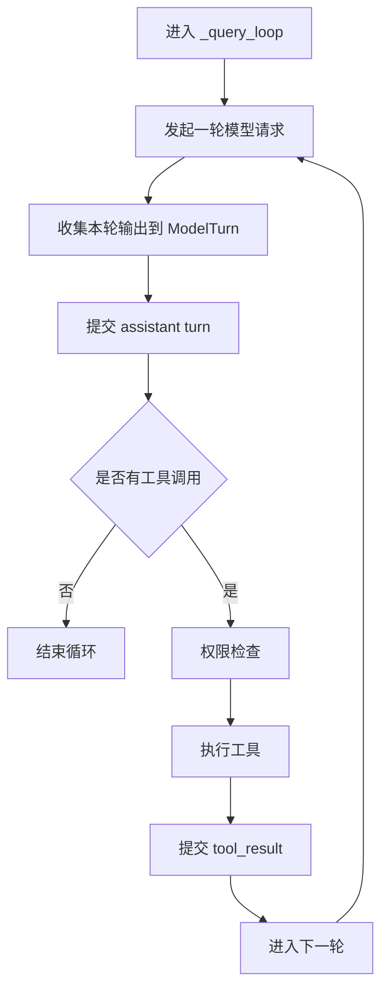
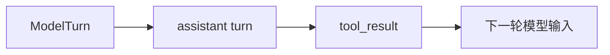

# XxCode 中的 `QueryEngine` 与 Agent Loop

> 本文是面向项目读者的解释型文档，主线聚焦 `QueryEngine` 与核心 `agent-loop`。上下文工程、memory、skills、compaction 等内容只在循环接入点轻带过，后续可拆分为独立文档。

## 目录

1. [主执行路径：从 `QueryEngine` 到 Agent Loop](#1-主执行路径从-queryengine-到-agent-loop)
2. [核心循环总览](#2-核心循环总览)
3. [请求如何进入循环](#3-请求如何进入循环)
4. [循环发生在哪里](#4-循环发生在哪里)
5. [核心循环的六个步骤](#5-核心循环的六个步骤)
6. [`ModelTurn`：本轮输出的临时状态](#6-modelturn本轮输出的临时状态)
7. [`assistant turn` 与 `tool_result` 的两次提交](#7-assistant-turn-与-tool_result-的两次提交)
8. [`tool_result` 如何进入下一轮](#8-tool_result-如何进入下一轮)
9. [真实任务如何被逐轮推进](#9-真实任务如何被逐轮推进)
10. [错误、截断和恢复在循环中的位置](#10-错误截断和恢复在循环中的位置)
11. [权限系统在循环中的位置](#11-权限系统在循环中的位置)
12. [`QueryEngine` 与 `CoreExecutionEngine` 的职责边界](#12-queryengine-与-coreexecutionengine-的职责边界)
13. [本文暂不展开的部分](#13-本文暂不展开的部分)
14. [推荐继续阅读的源码入口](#14-推荐继续阅读的源码入口)

## 1. 主执行路径：从 `QueryEngine` 到 Agent Loop

​	如果只用一句话概括 XxCode 的运行方式，那就是：它不是一次提问、一次回答的聊天程序，而是一套由 `QueryEngine` 驱动、由 `agent-loop` 完成任务闭环的受控执行系统。

​	很多人第一次看这类项目时，会下意识把注意力放在模型、工具列表或者 prompt 上。但真正把这些东西串起来、让系统“动起来”的，并不是某个单独模块，而是一条完整的执行路径：用户输入先进入 `QueryEngine`，外层完成会话与请求级准备；随后请求被交给 `CoreExecutionEngine`，内层进入真正的 agent loop，不断经历“模型输出 -> 工具执行 -> 结果回注 -> 再次决策”的过程，直到模型决定不再调用工具。

也就是说，`QueryEngine` 和 `agent-loop` 的关系，不是两个并列的小功能，而是一次任务从开始到结束的上下两层结构：

- `QueryEngine` 负责把一次用户请求组织好、送进系统
- `CoreExecutionEngine` 负责把这次请求真正跑完
- 两者合起来，才构成 XxCode 的主执行路径

后面整篇文章其实都围绕这条路径展开：先看请求怎样进入系统，再看请求进入以后，loop 怎样把一个任务一轮一轮推进到结束。

## 2. 核心循环总览



这张图只保留了最核心的闭环。后面无论是错误恢复、上下文压缩、memory 注入还是 skills，基本都可以视为对这条主循环的增强，而不会改变它的基本结构。

从阅读顺序上说，这张图也给后面的章节定了基调。接下来的内容不会把所有实现细节一次性铺开，而是顺着这条闭环，从外到内、从一轮到下一轮慢慢拆开。

## 3. 请求如何进入循环

在这条主执行路径里，`QueryEngine` 站在最外层。它不直接负责每一轮工具循环的细节，但它负责把一次请求正确地组织起来，并把它交给内层执行。

从 [query_engine.py](/f:/agent/XxCode/XxCode/src/xxcode/agent/query_engine.py:1) 顶部的类说明就能看出这一点：

```python
class QueryEngine:
    """Outer session manager: state init, slash handling, and loop delegation."""
```

这个定义其实很准确。`QueryEngine` 主要做的是三类事情：

- 请求进入前的准备
- 请求进入时的分流
- 请求结束后的收尾

其中，“准备”包括初始化 `AgentState`、刷新 system prompt、处理会话级状态；“分流”包括识别 slash command、skill 调用这类特殊入口；“收尾”则包括记录 cost、检查 budget、保存最新状态，供后续继续对话使用。

顺着这层职责往下看，`submit_message()` 基本就是最集中的入口。把复杂分支先折叠掉之后，它的主线非常清晰：

```python
async def submit_message(self, user_prompt: str, state: AgentState | None = None, ...):
    state = self._initialize_state(state)
    self._build_or_refresh_system_prompt(state, current_cwd)
    self._commit_user_turn(state, normalized_prompt)

    async for event in self.core_engine._query_loop(state):
        yield event
```

这几行代码本身就已经把 `QueryEngine` 的主任务交代得很清楚了。

- `self._initialize_state(state)`：准备或复用会话状态
- `self._build_or_refresh_system_prompt(...)`：确保系统提示词处于可用状态
- `self._commit_user_turn(...)`：把当前用户输入真正写进消息历史
- `self.core_engine._query_loop(state)`：把请求交给内层循环执行

所以严格来说，`QueryEngine` 并不“回答问题”。它做的是把一次请求包装成一个适合被 loop 执行的状态，再把 loop 产生的事件继续向外传递。

这里有一个范围上的约定也值得先说清楚。本文下面讲的，主要是 `submit_message()` 走入 `_query_loop()` 的主路径；像 slash command、skill fork 这类特殊分支虽然也在 `QueryEngine` 里，但不是这篇文章的主叙事。

一旦执行权交到 `_query_loop()` 手里，文章的视角也就会从“请求如何进入系统”，切换成“任务如何在系统内部被推进”。

## 4. 循环发生在哪里

真正的 agent-loop，发生在 [loop.py](/f:/agent/XxCode/XxCode/src/xxcode/agent/loop.py:1) 里的 `CoreExecutionEngine` 中。

这个文件开头其实已经把自己的定位写得非常明确了：

```python
"""CoreExecutionEngine - the inner tool-loop controller.

This module keeps the loop focused on orchestration:
1. stream model output
2. handle PTL / output truncation recovery
3. execute tools
4. resolve permissions
5. inject assistant / tool_result messages
"""
```

这段说明很值得慢一点读，因为它几乎概括了全文的核心：`CoreExecutionEngine` 不是一个“工具调用器”，也不是一个“模型客户端包装层”，它本质上是一个循环控制器。它的职责不是做某一件具体的小事，而是把一轮又一轮的模型决策、工具执行和结果回注组织成一个可持续推进的闭环。

从这个角度看，`CoreExecutionEngine` 面对的核心问题其实只有一个：模型这一轮是否需要调用工具；如果需要，系统怎样安全地执行这些工具，并让模型基于结果继续下一轮。

如果暂时忽略恢复逻辑、memory 注入、skill 注入这些增强能力，只看最核心的抽象，那么 `CoreExecutionEngine` 做的事情可以压缩成下面四步：

```python
# 1. 调用模型并流式接收输出
# 2. 把本轮 assistant 输出提交进消息历史
# 3. 执行模型请求的工具
# 4. 把 tool_result 写回消息历史，然后决定是否进入下一轮
```

接下来的几节，基本就是沿着这个抽象骨架继续往下拆，把它还原成更具体的控制流。

## 5. 核心循环的六个步骤

如果把 XxCode 的 `agent-loop` 尽量压缩成最小骨架，那么它其实就是总图里的六个动作。后面很多恢复逻辑、上下文处理、memory 注入，都是围绕这六步展开的增强层，但不会改变它的基本结构。

### 第一步：发起一轮模型请求

每一轮循环开始时，系统都会基于当前的 `state` 重新组织一份要发送给模型的请求。这里最重要的不是“调用模型”这件事本身，而是：这一轮模型看到的输入，已经包含了此前所有被提交进消息历史的内容。

在 [loop.py](/f:/agent/XxCode/XxCode/src/xxcode/agent/loop.py:610) 里，这一步大致是这样发生的：

```python
client = self._create_main_loop_client(...)
all_messages = self._build_messages(state)
tool_schemas = active_registry.get_api_schemas()

async for event in client.stream_chat(
    system_prompt=state.system_prompt,
    messages=all_messages,
    tools=tool_schemas,
):
    ...
```

这里可以注意两点。第一，发送给模型的不是裸的用户输入，而是 `state.messages` 经整理后的结果。第二，这一轮请求里会附带当前可用工具的 schema，所以模型不只是“回答问题”，还可以在回答过程中发出工具调用。

### 第二步：收集本轮输出到 `ModelTurn`

模型流式返回内容后，系统不会立刻把它当成最终结果处理，而是先收集到一个本轮临时状态对象 `ModelTurn` 里。

这个对象可以理解成“这一轮模型输出的缓冲区”。它至少会记录几类信息：

- 本轮输出的完整文本
- 本轮的 thinking 内容
- 本轮发出的工具调用
- 本轮的 token 用量
- 本轮是否出现截断或错误

在代码里，流式事件会被 `_handle_stream_event()` 一条条处理。例如：

```python
if event_type == "text_delta":
    turn.full_text += event["text"]

if event_type == "tool_use":
    tc = ToolCall(yo
        id=event["id"],
        name=event["name"],
        input=event["input"],
    )
    turn.tool_calls.append(tc)
    executor.add_tool(tc)
```

这一步非常关键，因为它把“零散的流式事件”收束成了“一轮完整输出”。也正因为有了这一步，loop 后面才有机会在“提交历史、执行工具、恢复异常”之间做判断。

### 第三步：提交 `assistant turn`

当一轮模型输出接收完成后，系统会把 `ModelTurn` 里的内容正式写入 `state.messages`。这一步就是图里的“提交 assistant turn”。

对应代码是：

```python
commit_assistant_turn(
    state,
    thinking_content=turn.thinking_content,
    full_text=turn.full_text,
    tool_calls=turn.tool_calls,
    message_id=turn.current_message_id,
    input_tokens=turn.input_tokens,
    output_tokens=turn.output_tokens,
)
```

这一步的意义可以概括成一句话：把本轮临时输出，变成正式历史。

### 第四步：判断是否有工具调用

提交完 `assistant turn` 之后，循环会立刻做一个最核心的判断：这一轮有没有 `tool_calls`。

```python
if not turn.tool_calls:
    cost = self._calculate_cost(state)
    self._last_state = state
    yield StreamEvent(type="cost", content=f"${cost:.4f}", metadata={"cost": cost})
    yield StreamEvent(type="done", content="")
    break
```

如果没有工具调用，说明模型认为在当前上下文下已经可以直接收束任务了，那么整个循环就到这里结束。反过来，只要还有工具调用，这个闭环就会继续往下推进。

### 第五步：权限检查并执行工具

如果本轮存在工具调用，系统不会立刻无条件执行，而是先走权限检查，再调用具体工具。

在主循环里，这两步分别对应：

```python
async for permission_event in self._resolve_tool_permissions(
    turn.tool_calls,
    executor,
    state,
):
    yield permission_event

async for event in self._execute_and_commit_tools(
    state,
    executor,
    pending_skill_messages,
):
    yield event
```

这里最重要的不是权限链的细节，而是要让读者明白：模型发出 `tool_use` 并不等于工具已经执行。中间还有一个系统控制层，负责拦截、确认和调度。

### 第六步：提交 `tool_result`，然后进入下一轮

工具执行完成后，系统会把结果重新写回消息历史。这一步就是整个循环真正闭合的地方。

从 agent-loop 的视角看，工具执行结果最重要的作用不是“显示给用户看”，而是成为下一轮模型输入的一部分。

从控制流上看，这一步结束后会发生两件事：

```python
state.turn_count += 1
...
# 回到 while True 顶部
```

这就是闭环真正形成的地方：

1. 模型提出工具请求
2. 系统执行工具
3. 工具结果写回消息历史
4. 循环回到顶部
5. 模型基于新历史进入下一轮

这六步已经足够勾出 agent-loop 最核心的运行方式。后面的章节不再重复整条骨架，而是顺着其中几个关键节点继续展开：本轮输出如何临时保存、正式历史怎样分两次提交、工具结果又怎样进入下一轮。

## 6. `ModelTurn`：本轮输出的临时状态

前面在第 5 节里，循环骨架已经走到了“收集本轮输出”这一步。真正承接这一步的，就是 `ModelTurn`。

可以把 `ModelTurn` 理解成“一轮模型输出的临时收集器”。模型不是一次性吐出完整对象，而是通过流式事件逐步返回文本、thinking、工具调用和 usage 信息。系统需要一个地方，把这些离散事件先拼成一个有结构的本轮结果。

在 [loop.py](/f:/agent/XxCode/XxCode/src/xxcode/agent/loop.py:122) 中，`ModelTurn` 大致包含：

- `full_text`
- `thinking_content`
- `tool_calls`
- `input_tokens` / `output_tokens`
- `output_truncated`
- `ptl_detected`
- `stream_had_error`

这样设计以后，流式阶段做的事情就很清楚了：不是直接“生成最终答案”，而是先组装出一个可提交、可恢复、可继续执行的回合状态。

这也解释了为什么 `_query_loop()` 不会在流式接收的当下立刻改写正式历史。对 loop 来说，先把这一轮输出稳定地收进 `ModelTurn`，后面才有空间决定：

- 这轮结果能不能直接提交
- 是否需要先走恢复逻辑
- 是否存在需要进入工具执行阶段的 `tool_calls`

## 7. `assistant turn` 与 `tool_result` 的两次提交

从 `ModelTurn` 再往后走，循环就会碰到一个很关键的边界：本轮输出什么时候进入正式历史，以及工具执行结果又在什么时候回到历史里。

当模型完成一轮输出时，系统手里拿到的还只是一个临时的 `ModelTurn`。里面收集了这一轮的文本、thinking，以及模型发出的 `tool_use`。这时候工具其实还没有执行，系统只是知道：模型刚刚做出了什么决策。

所以接下来的第一步，不是立刻去改消息历史里的工具结果，而是先把模型这一轮的输出正式落下来：

```python
commit_assistant_turn(
    state,
    thinking_content=turn.thinking_content,
    full_text=turn.full_text,
    tool_calls=turn.tool_calls,
    message_id=turn.current_message_id,
    input_tokens=turn.input_tokens,
    output_tokens=turn.output_tokens,
)
```

这一步做的事情很明确：把本轮模型输出写成一条 `role="assistant"` 的消息。里面包含三类内容：

- 模型这一轮说的文本
- 模型这一轮的 thinking
- 模型这一轮请求的 `tool_use`

也就是说，到这一步为止，消息历史记录下的是：模型刚刚决定了什么。

但这还不是一轮完整的闭环。因为模型只是提出了工具请求，工具本身还没有执行，外部世界也还没有给出反馈。接下来系统才会进入权限检查、工具执行，再收集工具结果。

等工具真正跑完之后，系统才把这些结果重新写回消息历史：

```python
commit_tool_results_turn(state, tool_results, executor)
```

最终写进去的不是另一条 assistant 消息，而是一条新的 `role="user"` 消息：

```python
state.messages.append({
    "role": "user",
    "content": deduped,
})
```

这里的 `role="user"` 不是随手选的，它对应的是这套消息格式里“把工具执行结果重新喂回模型”的那一侧。也就是说，assistant 先提出 `tool_use`，系统再把执行结果作为新的输入消息送回去，下一轮模型看到的就不只是自己的上一轮决策，还包括那次决策已经产生的结果。

这里就能看出这两次提交在循环里的位置其实完全不同。`assistant turn` 记录的是这一轮模型的输出；`tool_result` 记录的是系统执行之后返回的结果。

把它们分开写，整个循环的时间顺序就会非常清楚：

1. 模型先输出文本和 `tool_use`
2. 系统先把这轮模型输出记下来
3. 系统再去执行工具
4. 工具返回结果
5. 系统把结果再写回消息历史
6. 模型基于这份新历史进入下一轮

这条关系如果只用文字去读，有时还是会显得有点抽象。可以再用一张更小的图，把这几个状态点单独拎出来看：



这张小图和前面的总图关注的不是同一层问题。总图讲的是整个循环的骨架；这里讲的是一轮输出怎样逐步变成下一轮输入。

沿着这条时间顺序去看，`assistant turn` 和 `tool_result` 其实分别守住了 loop 里的两个阶段：

- 前者负责把“模型刚刚决定了什么”写进历史
- 后者负责把“系统刚刚执行出了什么结果”写进历史

一轮循环只有同时经过这两次提交，才算真正闭合。

## 8. `tool_result` 如何进入下一轮

到了这里，loop 里的关键问题已经不再是“工具有没有执行”，而是“执行结果如何回到模型输入里”。

如果只看表面，工具执行看起来像是一个中间步骤：模型发出 `tool_use`，系统执行工具，拿到结果，然后显示给用户。但如果只是“显示给用户”，那这套系统就无法形成真正的闭环。因为下一轮模型必须基于刚刚发生的事情继续决策，而“刚刚发生的事情”只有在进入消息历史之后，才会成为模型真正可见的上下文。

这也是为什么工具执行完成后，系统不会只发一个 `tool_result` 事件就算了，而是一定会把结果写回 `state.messages`。在 [messages.py](/f:/agent/XxCode/XxCode/src/xxcode/agent/messages.py:259) 中，这一步最终会追加一条新的消息：

```python
state.messages.append({
    "role": "user",
    "content": deduped,
})
```

这里最值得注意的是两点。

第一，`tool_result` 最终不是单独保存在某个工具执行缓存里，而是进入了消息历史。  
第二，它进入历史以后不再只是“执行日志”，而是成为了下一轮模型请求的一部分。

这一点和 `assistant turn` 正好形成对照：`assistant turn` 负责把“模型刚刚决定了什么”写进历史，`tool_result` 负责把“系统刚刚执行出了什么结果”写进历史。两者合在一起，才构成下一轮完整可见的上下文。

换句话说，loop 顶部下一次发起模型请求时，模型看到的输入已经不只是原始用户问题，也不只是上一轮 assistant 的输出，而是一个更完整的上下文序列：

1. 用户最初的任务
2. assistant 刚刚做出的工具调用决策
3. 工具执行后返回的真实结果

可以把这个最小序列理解成：

```python
[
  {"role": "user", "content": [{"type": "text", "text": "修复这个 bug"}]},
  {"role": "assistant", "content": [{"type": "tool_use", "name": "read_file", ...}]},
  {"role": "user", "content": [{"type": "tool_result", "tool_use_id": "...", "content": "..."}]},
]
```

这三条消息并不是在重复同一件事，而是在构造一个最小闭环：

- 第一条给出目标
- 第二条记录模型动作
- 第三条反馈动作结果

接下来模型的新一轮推理，就会以这三条消息为起点继续展开。也正因为这样，`tool_result` 才是 agent-loop 能持续推进多步任务的关键桥梁。没有这一步，模型就只能停留在“我打算做什么”；有了这一步，模型才真正知道“我刚刚做完了什么，以及结果如何”。

从这个意义上说，`tool_result` 不是工具执行阶段的尾声，而是下一轮循环的开端。

## 9. 真实任务如何被逐轮推进

前面几节已经把 loop 的骨架拆开了，接下来可以把这些抽象结构放回一个真实任务里看。这样更容易感受到它不是一个“会调用工具的聊天流程”，而是一套会逐轮推进状态的执行机制。

可以用一个很常见的任务来观察这个过程：

```text
请修复 auth 模块里的登录失败问题
```

这条请求进入 `QueryEngine` 后，会先被写成当前的 user turn，然后交给 `_query_loop()`。从这时开始，系统的目标就不再是“生成一段最终回答”，而是进入一个循环：先做一轮决策，再根据结果决定下一轮。

### 第一轮：先把任务从“问题”变成“可操作的上下文”

当模型第一次看到这条请求时，它通常并不知道 bug 的具体位置，也不知道该直接改哪段代码。这意味着第一轮最合理的动作往往不是修改，而是收集信息。

所以第一轮里，模型很可能会发出这样的工具调用：

- `read_file` 去看 auth 相关文件
- `grep_search` 去定位登录逻辑
- `glob_match` 去找可能相关的模块

从 loop 的视角看，这一轮做的事情并不复杂：

1. 发起模型请求
2. 收集文本、thinking 和 `tool_use`
3. 提交 `assistant turn`
4. 执行工具
5. 写回 `tool_result`

第一轮结束后，系统状态发生了一个关键变化：消息历史里已经不只是“用户要修一个 bug”，而是多了“模型刚刚查了什么，以及查到了什么”。

### 第二轮：基于第一轮结果，形成更具体的判断

第二轮开始时，模型看到的已经是更新后的消息历史。它不再面对一个纯粹的用户请求，而是在面对：

- 原始任务
- 自己上一轮的工具调用
- 工具返回的真实结果

这会让第二轮的动作和第一轮明显不同。第一轮偏向“找信息”，第二轮则更可能开始“做判断”。

例如模型可能判断出：

- 问题出在一个条件分支
- 登录失败是因为某个字段为空时处理不对
- 某个异常被错误吞掉了
- 还需要再看一个关联函数才能确定修复方式

如果判断还不够充分，它会继续调用读取类工具；如果判断已经比较明确，它可能会直接进入修改，比如调用 `edit_file`。

### 第三轮：从判断转向动作

当模型对问题定位足够明确之后，某一轮就会开始真正对代码或环境做动作。最典型的情况就是：

- 调用 `edit_file` 修改错误逻辑
- 调用 `write_file` 增加辅助内容
- 调用 `run_shell` 做验证或检查

这时 loop 仍然遵循完全一样的结构：

- 模型提出动作
- assistant turn 先落进历史
- 系统执行工具
- `tool_result` 回注进历史
- 下一轮继续

### 后续轮次：验证、修正，直到收敛

真实任务很少是“一改就对”。所以在修改之后，模型通常还会继续做一到多轮验证。

例如它可能会：

- 再读一遍刚修改的文件，确认改动是否落对了位置
- 跑一条测试命令，确认行为是否恢复正常
- 看一眼相关调用链，确认没有引入新的问题

如果验证结果不理想，loop 不会因此结束，而是继续推进下一轮。模型会基于新的 `tool_result` 再决定是否继续修改、是否换一种修复方式，或者是否需要补充额外检查。

### 最后一轮：模型不再请求动作，循环自然结束

任务真正结束时，loop 并不会收到一个额外的“完成信号”。它判断结束的方式很朴素：这一轮模型不再调用工具。

在代码里对应的就是：

```python
if not turn.tool_calls:
    cost = self._calculate_cost(state)
    self._last_state = state
    yield StreamEvent(type="cost", content=f"${cost:.4f}", metadata={"cost": cost})
    yield StreamEvent(type="done", content="")
    break
```

这意味着最后一轮通常会是这样的：

- 模型已经拿到了足够的信息
- 之前的修改也已经经过验证
- 这一轮只输出总结性文本
- 不再请求新的 `tool_use`
- loop 识别到本轮没有工具调用，于是结束

这个例子真正想说明的是：一个真实任务在 XxCode 里，不是靠一次大推理完成的，而是靠多轮状态推进逐步收敛的。

## 10. 错误、截断和恢复在循环中的位置

如果只看最简主图，XxCode 的 agent-loop 会显得很顺：发起一轮模型请求，收集输出，提交 `assistant turn`，执行工具，写回 `tool_result`，再进入下一轮。

但真实情况没有这么平滑。模型调用和工具循环之间，随时都可能遇到一些会打断节奏的问题。比如：

- API 流式请求中途出错
- 模型输出因为 token 上限被截断
- 消息历史或上下文状态进入某种不适合继续推进的状态

这些情况看起来像“异常处理细节”，但如果从 loop 的角度看，它们其实碰到的是一个更核心的问题：这一轮到底还能不能安全地继续推进。

所以这些逻辑不能放在 UI 层，也不能等循环结束以后再统一补救。它们必须长在 loop 里，而且必须长在一个非常具体的位置上：本轮模型输出已经收集完成，但 `assistant turn` 还没有正式提交之前。

这也是为什么在 `_query_loop()` 里，`commit_assistant_turn(...)` 前面会先经过一轮恢复判断。控制流大致是这样的：

```python
if turn.ptl_detected:
    action, recovery_event = await ptl_recovery.recover(state, turn.ptl_error_msg)
    ...

if turn.output_truncated:
    recovery_result = handle_output_truncation(...)
    ...

commit_assistant_turn(...)
```

这个顺序很关键。系统不是先把有问题的输出写进历史，再看能不能补救，而是先判断这一轮是否适合进入正式历史。

例如输出截断时，系统不会急着结束，而是会先尝试恢复。在 [output_recovery.py](/f:/agent/XxCode/XxCode/src/xxcode/agent/output_recovery.py:57) 里，可以看到这层判断：

```python
if tool_calls:
    return OutputRecoveryResult(action="proceed")

if not recovery.escalated:
    recovery.escalated = True
    recovery.current_max_tokens = ESCALATED_MAX_TOKENS
    return OutputRecoveryResult(action="retry")
```

这说明系统在处理截断时，首先关心的不是“报不报错”，而是“这轮结果是否还能保住，并继续推进 loop”。

同样，API 错误与 PTL 恢复本质上也在守同一条边界：不要让一轮还不适合落地的输出，过早进入正式消息历史。

所以这一节最重要的理解不是“有哪些异常分支”，而是：

- 恢复逻辑长在 loop 里，而不是长在 UI 层
- 它们发生在 `assistant turn` 提交之前
- 它们服务的核心问题是：这一轮是否还能安全进入正式历史，并继续推进循环

## 11. 权限系统在循环中的位置

当模型在一轮输出里发出 `tool_use` 时，下一步并不是立刻执行工具。在 XxCode 里，中间还隔着一个明确的权限阶段。这一步发生在 `assistant turn` 已经提交之后、工具真正执行之前，是主循环里一个独立的控制节点。

在主循环中，对应的代码是：

```python
async for permission_event in self._resolve_tool_permissions(
    turn.tool_calls,
    executor,
    state,
):
    yield permission_event
```

这意味着，系统在真正对文件系统、shell 或其他外部环境产生影响之前，会先把当前这批工具调用统一过一遍权限链。到了这一步，模型请求了什么已经非常清楚，但这些请求是否真的落地执行，还没有被决定。

从 loop 的角度看，这里守住的是一条很关键的边界：`assistant turn` 负责记录模型刚刚想做什么，权限阶段负责判断这些动作能不能进入真实执行。

真正负责这部分逻辑的是 [permission_resolver.py](/f:/agent/XxCode/XxCode/src/xxcode/agent/permission_resolver.py:1) 里的 `PermissionResolver`。它会逐个检查本轮工具调用，判断：

- 这个工具是不是只读
- 当前输入是否已经在许可范围内
- 这个命令是否可以被判定为安全
- 当前调用是否需要向用户发出 `permission_needed` 事件

如果需要用户确认，系统会在 loop 中产出一个显式事件：

```python
yield StreamEvent(
    type="permission_needed",
    content=tc.name,
    metadata={
        "tool_call": tc,
        "risk": risk,
        "dangerous": risk == "high",
    },
)
```

这一步很重要，因为它再次说明：模型并不直接支配执行环境。它能做的是提出动作请求，而是否真的执行，要由系统控制层来决定。

如果用户批准，工具会被加入实际执行路径；如果用户拒绝，系统也不会只是“什么都不做”，而是会生成一个拒绝结果，让 loop 继续保持状态一致。这样模型下一轮看到的上下文就会包含一个明确的信息：这个动作刚刚试图做过，但没有被允许。

所以权限系统在 loop 中的作用，不只是保护环境，更是在维护循环本身的可解释性。模型不仅要知道哪些动作成功执行了，也要知道哪些动作被拒绝了。只有这样，它才能在下一轮里真正调整策略，而不是盲目重复同样的请求。

## 12. `QueryEngine` 与 `CoreExecutionEngine` 的职责边界

回到架构层面再看，`QueryEngine` 和 `CoreExecutionEngine` 的拆分，其实是在把两类不同层级的问题分开处理。

`QueryEngine` 处理的是一次请求如何进入系统。  
`CoreExecutionEngine` 处理的是这次请求进入系统之后，如何在内部被循环推进。

这两个问题看起来连在一起，但关注点其实完全不同。前者更像是“入口编排”，后者更像是“运行内核”。

从 [query_engine.py](/f:/agent/XxCode/XxCode/src/xxcode/agent/query_engine.py:1) 看，`QueryEngine` 更像一个请求入口控制器。它关心的是：

- 当前有没有现成的 `AgentState` 可以复用
- system prompt 要不要刷新
- 当前输入是不是 slash command
- 当前输入是不是 skill 调用
- 本轮结束后 cost 怎么记录
- `_last_state` 什么时候更新

而从 [loop.py](/f:/agent/XxCode/XxCode/src/xxcode/agent/loop.py:141) 看，`CoreExecutionEngine` 关心的则是另一件事：

- 本轮模型要输出什么
- 本轮是否调用工具
- `assistant turn` 何时提交
- 工具何时执行
- `tool_result` 如何回注
- 下一轮是否继续

这种拆法有两个直接好处。

第一个好处是读代码时主线更清楚。想看“请求怎么进入系统”，就看 `QueryEngine`；想看“任务在系统里怎么跑起来”，就看 `_query_loop()`。两层职责边界比较干净。

第二个好处是演进空间更好。后面无论扩展 memory、skills、MCP、task runtime，还是加强恢复逻辑，都不需要把所有复杂度都压进一个入口函数里。外层继续管请求编排，内层继续管循环推进，代码结构不会那么容易塌。

## 13. 本文暂不展开的部分

到这里，主循环本身的骨架已经比较完整了。剩下还有不少重要能力已经接在 loop 周围，只是它们更适合单独展开，而不是继续挤在这篇主线文档里。

首先是上下文工程。它会影响每一轮发给模型的输入长什么样，包括消息规范化、上下文压缩、缓存断点、某些运行时注入等。但这些内容更像是在优化“这一轮模型看到什么”，而不是在改变循环本身的骨架。

其次是 memory。当前实现里，memory index 注入、recalled memories 预取、工具后追加 fresh recall、后台 extraction 这些能力都已经接在 loop 周围了。但如果在本文里展开它们，会很容易把主线从“循环如何推进任务”带偏到“记忆系统如何增强模型输入”。

再往后是 skills、MCP 和 task runtime。这些能力都很重要，也都和 loop 深度耦合，但它们更适合放在独立文档里，专门讲它们如何改变可用工具集合、如何影响执行上下文、如何在多任务和多 agent 情况下扩展这套 loop。

所以本文刻意只做了一件事：先把最核心的闭环讲清楚。也就是：

1. 请求如何进入 `_query_loop()`
2. 一轮模型输出如何被收集成 `ModelTurn`
3. `assistant turn` 和 `tool_result` 如何分别进入消息历史
4. loop 如何基于工具结果继续下一轮

把这条主线先讲透之后，再去看上下文工程、memory、skills 和多 agent 结构，读者会更容易分清哪些是“主循环本体”，哪些是“围绕主循环生长出来的增强层”。

## 14. 推荐继续阅读的源码入口

- [query_engine.py](/f:/agent/XxCode/XxCode/src/xxcode/agent/query_engine.py:1)
- [loop.py](/f:/agent/XxCode/XxCode/src/xxcode/agent/loop.py:1)
- [messages.py](/f:/agent/XxCode/XxCode/src/xxcode/agent/messages.py:1)
- [permission_resolver.py](/f:/agent/XxCode/XxCode/src/xxcode/agent/permission_resolver.py:1)
- [output_recovery.py](/f:/agent/XxCode/XxCode/src/xxcode/agent/output_recovery.py:1)
