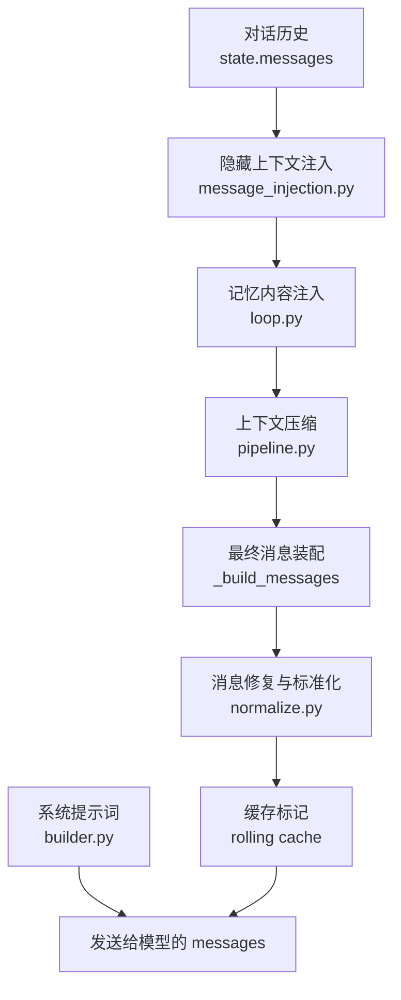
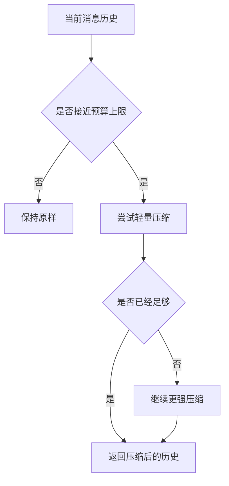
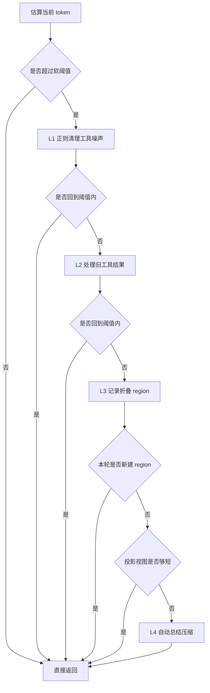
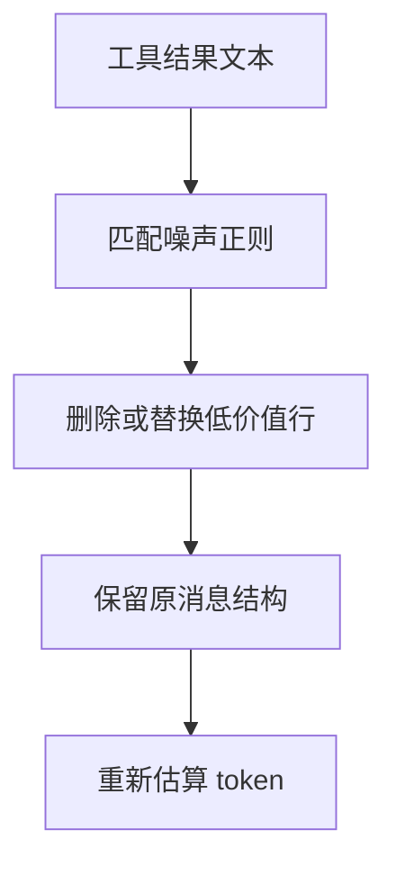
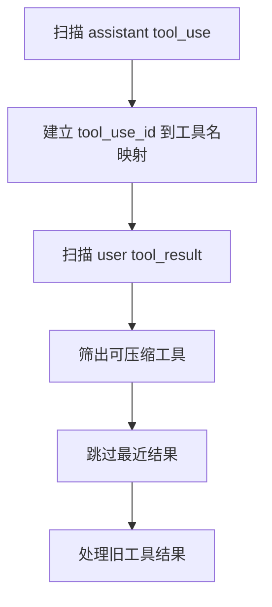
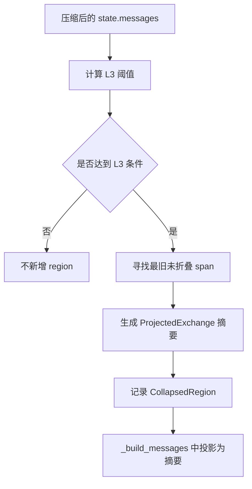
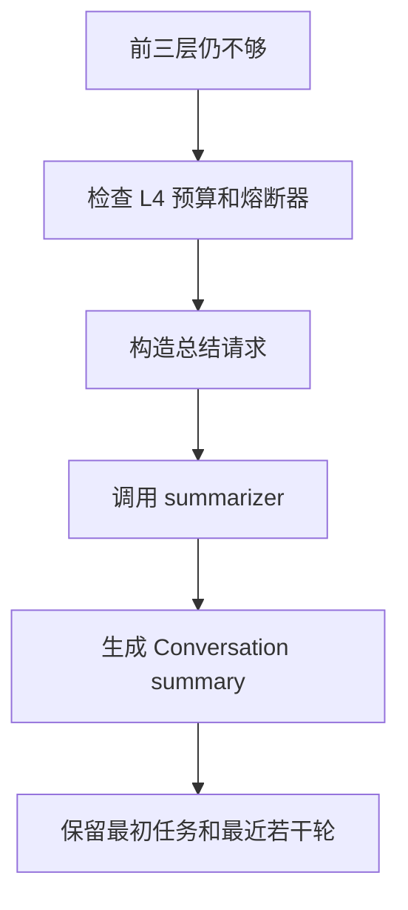
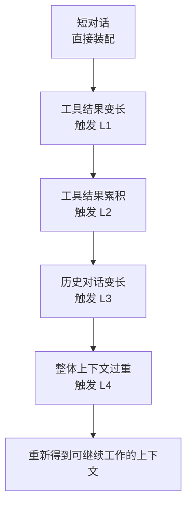
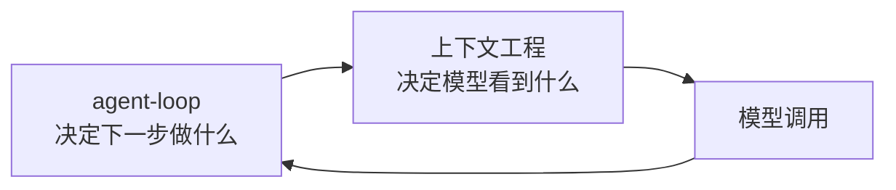

# XxCode 中的上下文工程

> 本文是面向项目读者的解释型文档，主线聚焦 XxCode 在每一轮模型调用前如何组装、压缩和修复上下文。`memory`、system prompt 细节、cache 策略和 token 估算差异会轻讲，后续可以拆成独立文档继续展开。

## 目录

1. [上下文工程在 XxCode 里解决什么问题](#1-上下文工程在-xxcode-里解决什么问题)
2. [一张总图：最终上下文是怎样被组装出来的](#2-一张总图最终上下文是怎样被组装出来的)
3. [上下文工程的输入与输出](#3-上下文工程的输入与输出)
4. [system prompt：稳定行为约束的起点](#4-system-prompt稳定行为约束的起点)
5. [消息历史不是最终上下文](#5-消息历史不是最终上下文)
6. [hidden context 的语义与插入位置](#6-hidden-context-的语义与插入位置)
7. [memory 在上下文工程里的接入位置](#7-memory-在上下文工程里的接入位置)
8. [`ContextPipeline`：压缩链路的核心调度器](#8-contextpipeline压缩链路的核心调度器)
9. [预算与触发模型：什么时候开始压缩](#9-预算与触发模型什么时候开始压缩)
10. [四层压缩的整体节奏](#10-四层压缩的整体节奏)
11. [L1 Snip：先删噪声，不改结构](#11-l1-snip先删噪声不改结构)
12. [L2 Microcompact：压小工具结果](#12-l2-microcompact压小工具结果)
13. [L3 Collapse：把旧对话折叠成摘要视图](#13-l3-collapse把旧对话折叠成摘要视图)
14. [L4 Autocompact：最重的一次性压缩](#14-l4-autocompact最重的一次性压缩)
15. [`_build_messages()`：最终模型输入是怎样形成的](#15-_build_messages最终模型输入是怎样形成的)
16. [一次真实长对话里，上下文工程怎样逐步介入](#16-一次真实长对话里上下文工程怎样逐步介入)
17. [上下文工程和 agent-loop 的边界](#17-上下文工程和-agent-loop-的边界)
18. [本文暂不展开的部分](#18-本文暂不展开的部分)
19. [推荐继续阅读的源码入口](#19-推荐继续阅读的源码入口)

## 1. 上下文工程在 XxCode 里解决什么问题

在一个普通聊天应用里，“上下文”通常就是历史消息加上一段 system prompt。但在 XxCode 这种 agent 项目里，模型看到的内容远不止这些。

一次真正的 agent 请求里，模型可能同时需要看到：

- 当前用户输入
- 最近几轮对话
- system prompt
- 工具调用结果
- 隐藏上下文
- memory 注入内容
- 压缩后的历史摘要
- cache 标记
- 被修复和标准化后的消息结构

所以 XxCode 的上下文工程，本质上不是简单地把消息数组传给模型，而是在每一轮模型调用之前，把“项目状态、对话历史、工具结果、长期记忆和运行约束”重新整理成一份模型可以消化的输入。

它要解决的核心问题是：模型每一轮到底应该看到什么、按什么顺序看到、看到多少，以及当内容太长时，哪些信息应该保留，哪些信息可以被压缩。

## 2. 一张总图：最终上下文是怎样被组装出来的

可以先把整个流程看成一条从“原始状态”到“最终模型输入”的加工链：



这张图里，中文描述表示这一步在做什么，下面的小字表示读源码时可以去哪里找。阅读时可以先顺着中文理解流程，等需要定位实现时，再去看对应的文件或函数。

`builder.py` 负责生成系统提示词，`state.messages` 提供对话历史。隐藏上下文和记忆内容会在当前轮模型调用前补充进来。之后，上下文压缩链路会根据预算决定是否压缩历史消息，必要时还会更新 L3 的 sidecar regions。最后，`_build_messages()` 会读取 `state.messages` 和 `_l3_regions`，完成折叠视图投影、结构修复、标准化、元数据剥离和缓存标记。

这里还有一个容易误会的点：system prompt 并不是被 `_build_messages()` 拼进 `state.messages` 的普通历史消息。它更像是 API 调用侧的一条并行输入线，和 `_build_messages()` 产出的历史消息一起构成最终模型输入。

换句话说，上下文压缩处理的是“历史消息还能不能装得下”的问题；最终消息装配处理的是“这一轮真正发给模型的历史 messages 应该长什么样”的问题；system prompt 则在更外层参与最终请求。

## 3. 上下文工程的输入与输出

从输入侧看，上下文工程拿到的不是单一文本，而是一组分散在不同位置的信息源。

用户输入通常会进入 `state.messages`。工具调用和工具结果也会成为消息历史的一部分。system prompt 由 `builder.py` 生成。隐藏上下文和 memory 则是在当前轮模型调用前临时插入，用来补充模型需要知道但不一定适合直接出现在普通对话历史里的信息。

从输出侧看，上下文工程最终产出的是传给模型客户端的 `messages`：

```python
async for chunk in client.stream_chat(
    messages=messages,
    tools=tools,
    ...
):
    ...
```

这份 `messages` 已经不是原始历史消息的直接拷贝。它可能包含压缩后的摘要，也可能去掉了过长的工具结果，还可能包含临时插入的 hidden context 和 memory 内容。

因此，理解 XxCode 的上下文工程时，不要把 `state.messages` 和“最终模型输入”画等号。前者更像运行状态，后者才是每一轮真实送进模型窗口里的内容。

## 4. system prompt：稳定行为约束的起点

system prompt 是上下文工程里最稳定的一层。它通常不会像对话历史那样频繁变化，也不会像工具结果那样膨胀得很快。它负责告诉模型：你是谁、你该如何工作、有哪些行为边界、工具应该怎样使用、输出应该遵守什么约束。

在 XxCode 里，这部分主要由 `builder.py` 构建。它不直接解决“上下文太长”的问题，但它决定了模型如何解释后续所有消息。

可以把 system prompt 理解成整个上下文的“操作系统配置”。用户消息、工具结果、memory、hidden context 都是在这套配置下被模型读取的。

这也是为什么 system prompt 通常放在最终消息的最前面。它先建立规则，再让模型阅读当前任务和历史状态。

## 5. 消息历史不是最终上下文

`state.messages` 保存的是 agent 到目前为止积累下来的对话状态。它里面可能有用户消息、助手回复、工具调用、工具结果，也可能有压缩后留下来的摘要消息。

但它仍然不是最终上下文。

最终上下文还需要经过几步处理：

- 插入当前轮需要的 hidden context
- 注入 memory 相关内容
- 判断是否需要压缩历史
- 对消息结构做 repair 和 normalize
- 去掉不该进入模型的字段
- 给适合缓存的消息打上 cache 标记

这也是阅读代码时容易混淆的一点：你在 `state.messages` 里看到的是“系统当前保存了什么”，而模型实际看到的是“本轮调用前重新组装后的 messages”。

这个区别很关键。上下文工程的很多设计，都是为了让 `state.messages` 可以持续积累，而最终模型输入仍然保持可控。

## 6. hidden context 的语义与插入位置

hidden context 不是普通聊天内容。它更像是“当前轮需要模型知道的额外说明”。

比如项目状态、运行环境、某些内部提示、或者不适合直接作为用户消息展示的上下文，都可以通过 hidden context 的方式补进去。它的目标不是替代用户输入，而是让模型在理解当前用户请求时，拥有更完整的背景。

它的插入位置也很有讲究：通常会放在当前用户消息之前。

这样做的语义是：模型先看到补充背景，再看到用户这轮真正提出的问题。于是 hidden context 会参与当前轮理解，但不会抢占用户消息本身的位置。

这一节先只讲语义，不展开具体实现。真正的实现并不是在 `_build_messages()` 里临时拼接 hidden context，而是在更早的位置通过 `_insert_before_current_user_message()` 直接写入 `state.messages`。后面的 `_build_messages()` 只读取已经注入好的消息，再做投影、修复、标准化和缓存标记。

## 7. memory 在上下文工程里的接入位置

memory 不属于普通消息历史，但它会影响模型理解当前任务。

在 XxCode 里，memory 更像是“跨轮次、跨会话的补充背景”。它可能记录用户偏好、项目约定、长期任务信息，或者之前总结出来的稳定事实。和 hidden context 不同的是，hidden context 更偏当前轮临时补充，memory 更偏长期可复用的信息。

不过在这篇文档里，我们不展开 memory 的内部实现。这里只需要知道它在上下文工程中的位置：memory 会在模型调用前被取出，并作为额外上下文注入到最终输入附近。

它和普通历史消息的区别在于：

- 普通历史消息记录“刚刚发生了什么”
- memory 记录“长期应该记住什么”
- hidden context 补充“这一轮额外需要知道什么”

这三者都会影响模型，但语义不同。上下文工程要做的事情，就是把它们放到合适的位置，让模型既能读懂当前任务，也不会被无关内容淹没。

## 8. `ContextPipeline`：压缩链路的核心调度器

当对话变长以后，不能每一轮都把完整历史塞给模型。工具结果可能很长，模型回复可能很多，用户也可能连续追加需求。如果不做处理，最终 `messages` 会越来越接近模型窗口上限。

`ContextPipeline` 就是在这个阶段介入的。

它的职责不是生成 system prompt，也不是最终调用模型，而是检查当前消息历史是否需要压缩。如果需要，它会按一定顺序尝试不同层级的压缩策略。

可以把它理解成上下文工程中的“压缩调度器”：



这里有一个关键点：`ContextPipeline` 处理的是 `state.messages` 这一类历史状态。它输出的结果，仍然是一份消息历史，只是里面可能已经删掉噪声、压缩工具结果，或者把早期对话折叠成摘要。

后面的 `_build_messages()` 会在这个结果基础上继续工作。也就是说，Pipeline 先把压缩结果写回 `state.messages`，让历史消息变得可控；`_build_messages()` 再读取 `state.messages`，生成这一轮真正发给模型的 API-ready 历史消息。

## 9. 预算与触发模型：什么时候开始压缩

上下文压缩不是随机发生的。它通常由 token 预算触发。

每一轮模型调用前，系统都会关心一个问题：当前要送进模型窗口的内容，大概占用了多少 token？如果占用很低，就没有必要压缩，因为压缩本身也可能带来信息损失。如果占用接近上限，就需要开始削减上下文体积。

这个判断一般会围绕几类数字展开：

- 模型可用的上下文窗口有多大
- system prompt、工具定义、当前用户输入会占多少
- 历史消息还剩多少可用空间
- 当前历史消息估算后是否超过阈值
- 压缩后是否已经回到安全范围

所以，预算模型不是单纯看 `state.messages.length`。消息条数少不代表 token 少，一个巨大的工具结果可能比几十条短消息还占空间。反过来，消息条数很多，但每条都很短，也不一定马上需要重压缩。

压缩层级的选择，也和预算压力有关。轻微超预算时，先做 L1 或 L2 这种低损耗处理；如果历史已经明显过长，才进入 L3；如果前面几层都不足以把上下文压回安全范围，才会触发 L4。

这种设计的核心思想是：先用信息损失最小的办法解决问题，解决不了再升级。

## 10. 四层压缩的整体节奏

XxCode 的上下文压缩不是一次性选择一个“压缩模式”，而是一条逐级升级的流水线。`ContextPipeline.compress()` 会先估算当前消息的 token 数，如果还没有超过软阈值，就直接返回原消息；一旦超过阈值，才按 L1 → L2 → L3 → L4 的顺序逐层尝试。



这里的“软阈值”来自 `context_limit * context_compress_threshold`。它不是等到模型窗口彻底爆掉才触发，而是在接近上限前提前处理，给后续输出和工具调用留空间。

L1 和 L2 执行完以后，Pipeline 会重新估算 token。如果已经回到阈值内，就停止，不会继续进入更重的层级。L3 稍微不同：如果本轮成功创建了新的 `CollapsedRegion`，它会认为“L3 已经赢得这一轮”，直接抑制 L4，让下一次 API-bound 视图通过 `_build_messages()` 投影变短。如果没有新 region 可建，Pipeline 会用已有 regions 生成 projected view；只有 projected view 仍然过重、并且允许主动 autocompact 时，才会继续考虑 L4。

四层之间的差异可以这样理解：

- L1 只处理工具结果里的噪声行，几乎不改变消息语义。
- L2 处理过期工具结果，按后端能力决定直接清内容，或者保留内容并产生 cache edit 意图。
- L3 不再直接改写普通历史，而是记录 collapsed regions，并在 API-bound 视图里投影成摘要。
- L4 调用模型生成整体摘要，是最重也最昂贵的一层。

`CompressionStats` 会记录每层释放了多少 token、最终到达哪一层、是否触发 L4 等信息。这些统计不是为了展示数字，而是为了让 loop 能知道本轮到底发生了什么，比如是否需要标记 skill 历史已被压缩。

## 11. L1 Snip：先删噪声，不改结构

L1 是最轻的一层压缩，对应 `snip.py` 里的 `snip_messages()`。它的目标不是重写历史，也不是总结对话，而是把工具结果里明显低价值的噪声行删掉。

在长对话里，L1 往往是最早出现的压缩动作。比如某一次工具调用返回了很长的日志、搜索结果、文件片段或者中间输出，完整保留会浪费大量 token，但后续真正需要的可能只是其中一小段。

L1 的核心原理是“正则清理”。它会遍历所有 `tool_result` block，对字符串内容应用一组预定义规则，比如：

- `pip install` 的下载、收集、安装进度
- `npm` / `yarn` 的安装噪声
- 进度条、百分比、重复状态行
- Docker pull/build 的 layer 进度
- Cargo / cmake 编译过程中的重复日志

这些内容的共同特点是：它们说明“过程发生过”，但通常不是后续推理最需要的事实。相比之下，错误信息、文件路径、测试失败摘要、最终输出更有价值。

简化后可以这样看：



它的特点是消息结构基本不变。原来是工具结果，压缩后仍然是工具结果；原来在对话里的位置，也不会被大幅移动。只是内容本身被缩短了。

这类压缩的好处是损耗小，风险也低。模型仍然能看到这条工具结果存在过，也能看到剩下的关键内容，只是不会被安装日志、进度条和重复状态行拖住。

L1 执行后，Pipeline 会立刻重新计算 token。如果这一步已经足够，就不会进入 L2。也就是说，L1 是“先打扫地面”，只有打扫完还放不下，才会开始搬家具。

## 12. L2 Microcompact：压小工具结果

如果 L1 之后上下文仍然偏大，L2 会继续处理工具结果，但它不再只是删噪声，而是专门处理“已经变旧”的工具结果。对应实现是 `micro.py` 里的 `microcompact_messages()`。

L2 的第一步是建立 `tool_use_id -> tool_name` 映射。原因是 `tool_result` block 自己只有 `tool_use_id`，工具名实际在前面的 assistant `tool_use` block 里。只有先把这张映射建出来，系统才知道某个结果来自哪个工具。

然后它只处理一组允许压缩的工具结果，比如 `read_file`、`run_shell`、`grep_search`、`glob_match`、`edit_file`、`write_file`。这些是 XxCode 自己注册的内置工具名，不是 Claude Code 里的 `FileRead`、`Bash` 这类展示别名。

它还会保留最近的若干条结果，默认保留最近 1 条。即使调用方传入 `keep_recent=0`，也会被 clamp 到至少保留 1 条。这样做是为了避免刚读完的文件、刚跑完的测试、刚完成的编辑结果立刻被清掉。旧结果可以瘦身，最新结果先保真。



L2 最有意思的地方是双路径设计。它不是永远直接改消息内容，而是根据前缀缓存和后端能力选择做法：

- Cache Cold：前缀缓存已经失效，旧工具结果可以直接在本地替换成 `[Old tool result content cleared]`。
- Cache Warm：前缀缓存仍然有价值，消息列表保持原样，同时生成 `CacheEdit(tool_use_id, action="delete")`，让请求侧有机会通过服务端缓存编辑释放旧结果。

在 `ContextPipeline.compress()` 当前主路径里，L2 仍以 `is_cache_cold=True` 调用，所以常规压缩会走本地替换路径。`micro.py` 同时保留 cache warm 分支，是为了支持“不要破坏可复用前缀，但又希望驱逐旧工具结果”的场景。

cache edit 还有一层运行时生命周期，放在 `CoreExecutionEngine` 上，而不是写进 `AgentState`。它大致分成三组：`pending` 表示准备发出的 edit，`consumed_in_flight` 表示已经挂到当前请求上的 edit，`pinned` 表示成功请求后仍需要在 TTL 内继续保留的 edit。请求失败时 in-flight 会退回 pending；请求成功时 in-flight 会转为 pinned；如果 provider 不是 Anthropic，或者配置没有打开 `anthropic_cache_edits_enabled`，这套状态不会进入请求。

这里要注意当前实现边界：`LLMRequestOptions` 和主 loop 的 pending / in-flight / pinned 生命周期已经存在，DeepSeek/OpenAI 路径也会忽略 Anthropic-only options；但 `AnthropicClient` 目前只在收到 `anthropic_cache_edits` 时记录 debug 日志，还没有把 cache edit schema 真正写入 Anthropic request body。所以文档里把它理解成“能力门控和生命周期已建立”，不要误读成“服务端 cache edit 已完整发送”。

这一层仍然尽量不动对话主干。用户说过什么、助手计划过什么，一般不会在 L2 被折叠成摘要。L2 主要瞄准的是工具结果，因为工具结果最容易变长，也最容易包含大量格式性噪声。

L2 后同样会重新估算 token。如果旧工具结果被清掉后已经回到安全范围，压缩就到此为止。

## 13. L3 Collapse：把旧对话折叠成摘要视图

当对话继续增长，单靠处理工具结果已经不够时，L3 会开始处理更早的对话历史。它的核心不再是“缩短某个工具结果”，而是“把一段旧历史变成摘要视图”。

当前 L3 的主路径已经改成 sidecar projection。也就是说，`ContextPipeline.compress()` 不再用 `collapse_messages()` 直接替换普通历史，而是调用 `apply_collapse_if_needed()`，生成或更新一组 `CollapsedRegion`。

`CollapsedRegion` 记录的是“原始消息列表中哪一段可以被折叠，以及折叠后应该显示什么摘要”。这组 region 会通过 `CompressionStats.collapsed_regions` 返回给 loop，再由 `CoreExecutionEngine._l3_regions` 暂存。`state.messages` 在正常 L3 下保持不变。

可以这样理解：



L3 的触发阈值也变得更明确。`get_l3_collapse_threshold()` 会取三者的最小值：默认 90K、当前 pipeline 的 soft limit、以及 L4 触发阈值减 1。这样做是为了保证 L3 一定有机会先于 L4 介入，不会出现“还没来得及折叠旧历史，就直接进入 L4”的空档。

摘要本身仍然不是调用大模型生成的，而是基于结构做投影：文本块取短摘要，`tool_use` 记录工具名，`tool_result` 保留输出首行作为 key output。换句话说，L3 是结构化折叠，不是语义级重写。

真正影响模型输入的动作发生在读取侧。`_build_messages()` 会在 API 调用前检查 `_l3_regions`，如果存在，就调用 `project_collapsed_view(list(state.messages), self._l3_regions)`，把 region 覆盖的消息替换成一条摘要 user message。内部历史仍然保留完整原文，只有 API-bound 视图变短。

`collapse_messages()` 现在更像 PTL recovery 的 destructive drain 路径。比如 API 已经报 Prompt-Too-Long，`PTLRecoveryManager.try_collapse_drain()` 可以用它直接缩短 `state.messages`，因为这时系统已经处在“请求发不出去”的恢复场景里。

L3 的信息损耗比 L1 和 L2 更明显，因为模型不再逐条看到那段历史。但它带来的收益也更大：一段很长的历史可以被压成一条摘要消息，给当前轮任务释放出大量空间。

好的 L3 摘要应该保留几类信息：

- 用户明确确认过的需求
- 已经做出的设计决策
- 重要文件、函数、模块名称
- 已完成和未完成的工作
- 不能违反的约束

它不应该把所有细节都揉成一段泛泛而谈的总结。对 agent 来说，摘要最有价值的地方不是“这段对话聊了什么”，而是“接下来继续工作时不能忘什么”。

## 14. L4 Autocompact：最重的一次性压缩

L4 是四层里最重的一层。它通常不会一开始就出现，而是在前面的 L1、L2、L3 都不足以把上下文压回安全范围时才介入。

这一层的目标是对上下文做更彻底的自动压缩。它不只处理某几条工具结果，也不只是折叠一段旧历史，而是把当前消息历史交给一个 summarizer，让模型生成结构化摘要。

在长对话里，L4 往往意味着任务已经积累了大量历史：多轮需求变更、多次代码探索、许多工具输出、已经做过的修改、测试结果、用户偏好和未完成事项。如果继续保留原始历史，模型窗口就会被历史本身挤满，反而没有空间处理当前请求。

L4 的触发比前三层更谨慎。它现在受几道门控制：`allow_autocompact` 必须为真，L3 本轮没有新建 region 抢先解决问题，熔断器没有触发，然后才进入 `should_autocompact()` 的严格预算判断：

- `effective_window = context_limit - MAX_OUTPUT_TOKENS_FOR_SUMMARY`
- `trigger_threshold = effective_window - AUTOCOMPACT_BUFFER_TOKENS`
- L1 已经释放的 token 会从当前 token 中扣除，避免刚刚 snip 过的上下文又误触发 L4。

也就是说，L4 不只是“超过阈值就启动”。它会给摘要输出预留空间，也会考虑前面层级已经释放的空间，还会避免在 sub-agent、memory、summary 这类不应该递归 compact 的场景里主动启动。

执行时，Pipeline 会先用 L3 的 projected view 作为 L4 的输入，再构造一个 summary prompt，把历史消息中的文本片段、工具调用信息等整理给 summarizer。summarizer 的 system prompt 会要求输出一份短结构摘要，包含关键决策、修改过的文件、遇到的错误和当前任务状态。



摘要生成后，`_inject_summary()` 会用一条 `[Conversation summary]` 消息替代大部分旧历史，同时保留最初消息和最近若干轮。这样做的目的很明确：保留任务起点、保留最新状态，中间过程用摘要承接。

它的优点是压缩幅度大，能把非常长的上下文重新拉回可用范围。代价是信息重写程度也更高，一些低频细节可能会被丢掉。L4 释放的是最大空间，也承担最大语义风险。

所以 L4 更依赖摘要质量。它需要尽量保住这些内容：

- 当前用户真正想完成的目标
- 已经确认的范围和排除项
- 最近的代码改动和测试状态
- 重要错误、阻塞点和约束
- 下一步应该继续做什么

可以把 L4 看成上下文工程里的最后一道兜底：当历史已经太重时，它帮 agent 把任务状态重新整理成一份还能继续前进的简洁版本。

为了让这道兜底尽量安全，L4 相关逻辑还做了几层容错和清理。

- 熔断器：连续多次 autocompact 失败后，会禁用 L4，避免每一轮都重复撞同一个失败路径。
- PTL 重试：如果摘要请求本身触发 Prompt-Too-Long，会截断头部后重试，最多重试若干次。
- Post-compact 记忆恢复：成功 L4 后，loop 会从 `state.read_file_state` 里取最近完整读取过的文件，跳过 partial view，再通过 `run_post_compact_cleanup()` 注入恢复消息，避免刚读完的关键文件因为压缩而消失。
- 运行时状态清理：成功 L4 或 PTL destructive drain 改写历史后，会清空 `_l3_regions`、L2 cache edit runtime state 和 `state.cache_breakpoints`，因为这些 sidecar 状态都依赖旧消息索引或旧请求视图。

所以 L4 不只是“强行总结”。它更像一个带保护的最后手段：尽量压缩，同时尽量避免压缩过程本身把 agent 推进不可恢复状态。

## 15. `_build_messages()`：最终模型输入是怎样形成的

到这里为止，`ContextPipeline` 已经处理完“历史消息是否太长”的问题。它的输出不再只是“压缩后的 `state.messages`”这么简单：L1/L2 和 L4 可能返回新的消息列表，L3 则可能通过 `CompressionStats.collapsed_regions` 返回 sidecar 投影状态。主 loop 会把消息列表写回 `state.messages`，同时把 L3 regions 保存到 `CoreExecutionEngine._l3_regions`。

但模型最终看到的 `messages`，还需要 `_build_messages()` 再装配一次。

这一步可以理解成上下文工程的最后一道历史消息出口。需要注意：hidden context 和 memory 在调用 `_build_messages()` 之前已经注入 `state.messages`，这里不会再调用 `insert_hidden_context()` 或 `inject_memory()`。`_build_messages()` 的职责是读取当前状态，并把它变成 API 可以接收的历史消息列表。

用简化后的伪代码看，大概是这个形态：

```python
if l3_regions:
    messages = project_collapsed_view(list(state.messages), l3_regions)
else:
    messages = list(state.messages)

messages = _repair_orphan_tools(messages)
messages = normalize_messages(
    messages,
    model_family=config.api_model,
    recent_errors=state.recent_api_errors,
)
messages = _strip_message_metadata(messages)
messages = _apply_rolling_cache(messages, state)
```

真实代码里的顺序正是这条线：如果 `_l3_regions` 非空，`project_collapsed_view()` 会先把 L3 的 sidecar region 投影成摘要视图；否则就直接复制 `state.messages`。随后 `_repair_orphan_tools()` 做一轮简单孤儿修复，`normalize_messages()` 执行完整标准化流水线，`_strip_message_metadata()` 移除内部字段，最后 `_apply_rolling_cache()` 给合适的消息加上缓存标记。

`_build_messages()` 之后，主 loop 还会从最终 API-bound messages 中扫描可见的 `tool_result_id`。这一步用于过滤 L2 cache edits：如果某个 pending 或 pinned edit 的 `tool_use_id` 已经因为 L3 projection、PTL drain 或 L4 历史改写而不在最终请求视图里，它就不应该继续发出或保留。

`normalize_messages()` 内部不是一个笼统的“清理函数”，而是固定执行七步：

- `reorder_attachments`：把媒体块前置，满足模型对多模态内容顺序的要求。
- `filter_virtual_messages`：过滤 `isVirtual=True` 的虚拟消息。
- `build_error_block_map`：根据最近 API 错误扫描需要剥离的目标。
- `strip_internal_elements`：移除 `tool_reference`、`advisor_block`、错误媒体等内部元素。
- `handle_thinking_blocks`：按模型支持情况保留或剥离 thinking/signature。
- `merge_split_messages`：合并同 ID 的流式分段 assistant 消息。
- `fix_tool_pairings`：修复孤儿 `tool_use` / `tool_result` 配对。

这里还有一道双重防线：`_repair_orphan_tools()` 会先移除明显孤立的工具块，`fix_tool_pairings()` 再在标准化末尾做更强的配对修复，必要时注入合成消息。前者偏轻量清理，后者偏 API 兼容性兜底。

最终送进模型的不是“原始历史”，而是一份已经整理过的上下文视图。它既要保留任务连续性，也要满足模型 API 对消息格式的要求。

## 16. 一次真实长对话里，上下文工程怎样逐步介入

可以想象一个典型任务：用户让 agent 阅读项目代码，解释某个模块，然后继续修改实现、运行测试、调整 README，最后再写一份详细文档。

一开始，对话很短。上下文工程主要做的是基础装配：system prompt 放在前面，用户消息进入历史，工具定义和必要上下文一起送给模型。这时通常不需要压缩。

随着 agent 开始读文件，工具结果变多。第一次明显变长的，往往不是用户消息，而是工具输出。比如一次 `rg` 返回很多匹配结果，或者一次文件读取带回了很长代码。这时 L1 可能先出现，由 `pipeline.py` 调度到 `snip.py`，裁掉明显冗余的部分。

继续往后，agent 多次搜索、读文件、跑测试、编辑文件，工具结果开始累积。单条消息可能不算特别巨大，但加起来已经很占空间。这时 L2 会更有价值，由 `micro.py` 处理 XxCode 内置工具名下的旧结果。常规 pipeline 目前走 cache cold 直接清空旧结果；cache warm 分支会生成 `CacheEdit`，并由主 loop 的 pending / in-flight / pinned 生命周期管理。

如果任务继续延长，早期需求讨论和探索过程开始占据大量窗口。此时模型并不一定需要逐字看到最早的所有消息，只需要知道当时确定了什么。这时 L3 会进入 `collapse.py`，当前主路径通过 `apply_collapse_if_needed()` 生成 `CollapsedRegion`，主 loop 保存到 `_l3_regions`，再由 `_build_messages()` 调用 `project_collapsed_view()` 在 API 调用前投影成摘要视图。

再往后，如果任务跨度非常长，前面几层压缩仍然不够，且 `allow_autocompact` 允许主动压缩，L4 才会介入。它会基于 L3 projected view 做整体摘要，成功后替换历史，并清理 `_l3_regions`、L2 cache edit runtime state 和 cache breakpoints，再通过 post-compact 记忆恢复补回最近读取的文件内容。

整个过程可以简化成这样：



这也是 XxCode 上下文工程的核心节奏：不是等到爆窗才处理，而是在上下文变长的过程中，逐步用更强的方式换取空间。

## 17. 上下文工程和 agent-loop 的边界

agent-loop 负责让 agent 一轮一轮地行动：接收用户请求，调用模型，解析模型输出，执行工具，再把结果带回下一轮。

上下文工程则负责每一轮模型调用之前的“输入整理”。

可以这样分开理解：



agent-loop 更关心控制流：什么时候继续循环，什么时候调用工具，什么时候结束任务，什么时候处理错误。

上下文工程更关心信息流：哪些消息进入模型，哪些内容被压缩，hidden context 放在哪里，memory 怎样接入，最终 messages 是否符合模型需要的结构。

这两个部分会在代码里交汇。比如 loop 在每轮调用模型前，会触发上下文相关逻辑；压缩完成后，loop 还会继续负责调用模型和处理输出。但概念上，把它们分开看会更清楚：

agent-loop 是“行动循环”，上下文工程是“每次行动前整理背包”。

## 18. 本文暂不展开的部分

这篇文档主要解释上下文工程的主线：从 system prompt、历史消息、hidden context、memory，到压缩链路和最终消息装配。

有几个相关主题会点到为止：

- memory 的存储、检索和更新策略
- system prompt 的完整构建规则
- 不同模型的 token 估算差异
- 工具 schema 如何影响上下文预算
- 压缩摘要的质量评估
- cache 策略对成本和速度的影响

这些内容都和上下文工程有关，但如果全部放在一篇里，会让主线变散。更适合后续拆成单独文档讲。

这篇先回答一个核心问题：XxCode 在每一轮模型调用前，怎样把一堆分散的信息整理成模型真正看到的上下文。

## 19. 推荐继续阅读的源码入口

如果读者想顺着源码继续看，可以从这几个位置开始：

- `src/xxcode/context/builder.py`：看 system prompt 和基础上下文怎样构建。
- `src/xxcode/context/pipeline.py`：看上下文压缩链路怎样调度。
- `src/xxcode/context/snip.py`：看 L1 怎样裁剪过长内容。
- `src/xxcode/context/micro.py`：看 L2 的 cache cold / cache warm 双路径。
- `src/xxcode/context/collapse.py`：看旧历史如何被折叠成摘要。
- `src/xxcode/context/auto.py`：看更重的自动压缩逻辑。
- `src/xxcode/agent/ptl_recovery.py`：看 Prompt-Too-Long 时的 destructive collapse drain 和 reactive compact。
- `src/xxcode/agent/loop.py`：看上下文工程怎样接入 agent-loop，以及 `_build_messages()` 怎样生成最终模型输入。
- `src/xxcode/api/client.py`：看 `LLMRequestOptions` 和 Anthropic / DeepSeek 对 cache edit options 的边界处理。
- `src/xxcode/config.py`：看 `prompt_cache_ttl_seconds` 和 `anthropic_cache_edits_enabled` 的配置入口。
- `src/xxcode/agent/messages.py`：看 `_repair_orphan_tools()` 的轻量孤儿工具修复。
- `src/xxcode/agent/message_injection.py`：看 hidden context 注入和 `_strip_message_metadata()`。
- `src/xxcode/agent/normalize.py`：看消息结构怎样被修复和标准化。

阅读顺序建议先看 `loop.py` 里的调用位置，再跳到 `pipeline.py` 理解压缩策略，最后回到 `_build_messages()` 看最终装配。这样会比从某个压缩函数一路钻下去更容易把全局串起来。
