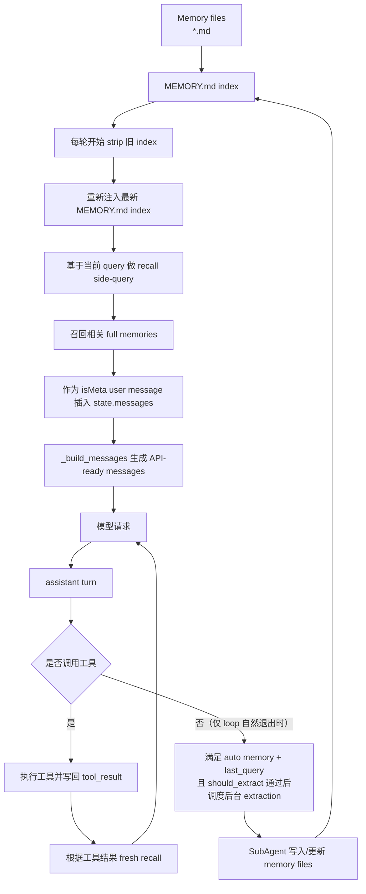

# XxCode 中的 Memory

> 本文是面向项目读者的解释型文档，主线聚焦 XxCode 的 memory 系统：它保存什么、什么时候被召回、怎样注入上下文、怎样在后台沉淀新记忆，以及它和 agent-loop、上下文工程之间的边界。

## 目录

1. [Memory 在 XxCode 里解决什么问题](#1-memory-在-xxcode-里解决什么问题)
2. [一张总图：memory 如何流入和流出主循环](#2-一张总图memory-如何流入和流出主循环)
3. [Memory 的存储模型](#3-memory-的存储模型)
4. [Memory 如何作为隐式用户消息注入上下文](#4-memory-如何作为隐式用户消息注入上下文)
5. [双通道注入模型：index 和 full memories](#5-双通道注入模型index-和-full-memories)
6. [工具执行后的 fresh recall](#6-工具执行后的-fresh-recall)
7. [后台 extraction：对话结束后怎样沉淀新 memory](#7-后台-extraction对话结束后怎样沉淀新-memory)
8. [主 memory 和 sub-agent memory](#8-主-memory-和-sub-agent-memory)
9. [Cleanup：启动时保洁、访问时间和数量上限](#9-cleanup启动时保洁访问时间和数量上限)
10. [Memory 和 agent-loop / 上下文工程的边界](#10-memory-和-agent-loop--上下文工程的边界)
11. [推荐继续阅读的源码入口](#11-推荐继续阅读的源码入口)

## 1. Memory 在 XxCode 里解决什么问题

在一个普通聊天应用里，模型能依赖的主要是当前 prompt 和最近对话历史。但在 XxCode 这种 agent 系统里，任务经常跨越很多轮，甚至跨越多个会话。用户偏好、项目约定、长期反馈、外部系统线索，如果只留在某一次 `state.messages` 里，很容易随着上下文压缩、会话结束或历史清理而消失。

Memory 要解决的就是这个问题：把“未来仍然可能有用的信息”从一次对话里沉淀出来，保存成可复用的持久知识，并在后续任务里按需召回。

它和普通对话历史、hidden context 的区别可以这样理解：

- 普通历史消息记录“刚刚发生了什么”
- Hidden context 补充“这一轮临时需要知道什么”
- Memory 保存“跨会话仍然应该记住什么”

所以 memory 不是把所有历史永久塞给模型。它更像一套可检索的长期背景库：平时以紧凑索引的形式存在，需要时再召回完整内容。

在 XxCode 里，memory 主要承载几类信息：

- 用户长期偏好，例如代码风格、交流方式、工作习惯
- 用户反馈，例如“以后不要这样做”，或“这个非显然做法被确认有效”
- 项目级决策，例如某个长期任务、约定、截止日期
- 参考信息，例如 issue tracker、dashboard、外部文档入口

它刻意不保存代码细节、架构事实、Git 历史或某次调试的具体修复。原因也很直接：这些内容应该从当前代码和 Git 里重新确认，而不是依赖一条可能过期的记忆。

## 2. 一张总图：memory 如何流入和流出主循环

先从整体流程看，memory 系统在主循环的两端同时工作。

下文默认 memory 已经在 session 启动阶段启用，并且 memory directory 可以解析出来；启用判断属于启动层，不是这篇的主线。



这张图里有两个方向：

第一条是读取方向。每次进入主循环时，系统都会刷新 `MEMORY.md` index 的注入，然后根据当前任务做一次轻量 recall。如果选中了相关 memory，就把完整 memory 文件内容作为隐式用户上下文插入对话。

第二条是写入方向。当主循环自然收敛，也就是模型不再调用工具时，系统会尝试调度后台 extraction。这里还必须满足 auto memory 开启、memory directory 存在、`state.last_query` 存在，以及 extraction controller 的节流和互斥检查通过。这个 extraction 不是主模型随手写几行文件，而是一个受限的 `SubAgent`，负责从最近对话里提取真正值得长期保存的信息。

理解 memory 时，最重要的一点是：memory 不改变 agent-loop 的基本闭环。loop 仍然是“模型输出 -> 工具执行 -> tool_result 回注 -> 下一轮模型请求”。Memory 做的是增强每轮模型请求前的上下文来源，以及在任务结束后把有价值的信息沉淀出去。

## 3. Memory 的存储模型

XxCode 的主 memory 存在一个 memory directory 里。这个目录通常来自启动阶段的 `resolve_memory_directory()`：环境变量覆盖优先，其次是配置项，最后是按当前项目生成的默认目录。目录里有两类 Markdown 文件：

- `MEMORY.md`：入口索引，只保存每条 memory 的标题、文件名和一句描述
- 其他 `.md` 文件：单条 memory 的完整内容

单条 memory 文件使用 YAML frontmatter。对应的数据结构是 `src/xxcode/memory/models.py` 里的 `MemoryEntry`：

```yaml
---
name: user-prefers-concise-status
description: User prefers concise progress updates during long tasks.
metadata:
  type: user
---

The user prefers short, concrete progress updates while work is ongoing.
```

`metadata.type` 会被解析成 `MemoryType`。当前主要有四类：

- `user`：用户身份、偏好、知识背景、工作习惯
- `feedback`：用户对 agent 行为的纠正或确认
- `project`：持续任务、项目决策、绝对日期化后的时间信息
- `reference`：外部系统、文档、dashboard、issue tracker 入口

文件名来自 `slugify_name()`，也就是把 memory name 转成适合落盘的 kebab slug。读写由 `MemoryStore` 负责。它提供 `list_entries()`、`get_entry()`、`save_entry()`、`delete_entry()` 等操作，并且写文件时走临时文件加 `os.replace()` 的原子替换路径。

`MEMORY.md` 不是手写目录，而是由 `src/xxcode/memory/index.py` 维护。它有两条更新路径：

- 全量路径：`generate_memory_index()` + `write_memory_index()`，会从所有 memory 文件重建索引，并按类型和文件名排序
- 增量路径：`update_index_entry()` + `remove_index_entry()`，会在现有 index 里替换、追加或移除单行，不重新排序，所以顺序可能轻微 drift

主 agent 直接写 memory 目录后，以及 extraction 完成后，都会走 `write_memory_index()` 做一次全量刷新。它大致长这样：

```markdown
- [User Prefers Concise Status](user-prefers-concise-status.md) - User prefers concise progress updates during long tasks.
- [Project Release Constraint](project-release-constraint.md) - Release branch must stay compatible with Python 3.11.
```

这个索引有明确预算限制：

- 每行最多约 `_LINE_BUDGET = 150` 字符
- 整个入口最多 `MAX_ENTRYPOINT_LINES = 200` 行
- 整个入口最多 `MAX_ENTRYPOINT_BYTES = 25_000` 字节

`truncate_entrypoint_content()` 会同时执行行数和字节限制。如果超限，它会截断 `MEMORY.md` 内容，并追加一条 warning，提示只有部分索引被加载。这个机制很关键：memory 文件可以逐渐增长，但每轮注入给模型看的入口索引必须保持可控。

## 4. Memory 如何作为隐式用户消息注入上下文

Memory 的完整内容并不是直接拼进 system prompt。

这里要分清两层：

第一层是 memory 行为规则。它会进入 system prompt，但作用是“告诉模型 memory 是什么、应该如何使用”，而不是把 memory 内容本身塞进去。这个行为规则由 prompt builder 组装进系统提示词，属于上下文策略的一部分。

第二层才是真正的 memory 内容。`MEMORY.md` index 和 recalled full memories 都是通过 `isMeta: True` 的 user message 注入到 `state.messages`，并包在 `<system-reminder>` 标签里。构造逻辑在 `src/xxcode/memory/injection.py`：

```python
{
    "role": "user",
    "content": [{"type": "text", "text": "<system-reminder>...</system-reminder>"}],
    "isMeta": True,
    "metadata": {
        "xxcode_memory_context": True,
        "source": "...",
    },
}
```

这些消息会插入到当前自然语言 user turn 之前。插入位置由 `agent/message_injection.py` 里的 `_insert_before_current_user_message()` 控制。它会跳过仅承载 `tool_result` 的 user message，尽量把 memory 放在当前用户请求之前，让模型先看到相关背景，再看到这轮真正要做的任务。

这种设计有两个好处：

- 语义上，memory 是“当前轮额外上下文”，不是用户刚刚说的话
- 结构上，它仍然是普通 messages 的一部分，可以被压缩、排序、修复和最终组装流程统一处理

在真正发 API 请求之前，`_strip_message_metadata()` 会剥离 `isMeta` 和 `metadata` 字段。也就是说，模型最终看到的是一个普通 user message，其文本里包含 `<system-reminder>`；内部用来标记来源和去重的字段不会发送给模型 API。

## 5. 双通道注入模型：index 和 full memories

Memory 注入面临一个核心矛盾：模型需要上下文来回答问题，但系统既不能把所有记忆全文塞进上下文里，也不能先问模型“你想要哪条 memory”再加载。前者太大，后者会多一轮延迟。

XxCode 的解法是把 memory 拆成两条独立通道，在一个请求里同时覆盖广度和深度：

- **通道 A：`MEMORY.md` index（全量摘要）**。每轮刷新，把当前所有记忆的一行描述嵌入对话。模型看到后就有了目录式认知，知道有哪些记忆领域存在，即使全文没有被召回，一行摘要通常也足够做出正确判断。
- **通道 B：recalled full memories（精选全文）**。系统先用一个独立的侧查询 AI 浏览同样的 `MEMORY.md`，根据当前 query 选出最多 5 条最相关的记忆，加载完整内容后再注入对话。这个选择发生在主模型收到请求之前，不会额外增加一轮交互。

两条通道拼在一起后，模型既有浅层兜底，也有关键领域的深层上下文：

- 通道 A 保证模型对所有记忆领域都有广度认知
- 通道 B 保证模型在真正相关的记忆上拿到全文细节

这也自然带来了它们不同的生命周期：

- 通道 A 每轮 strip 再注入。因为 `MEMORY.md` 可能在对话中被 extraction 更新，旧索引会过时。strip + 重注入保证模型永远看到最新的记忆清单。
- 通道 B 注入后保留在 `state.messages` 中，不随 A 一起 strip。去重通过 `already_surfaced` 集合实现：后续 recall 时从已有消息的 metadata 里读出 `recall_ids`，告诉侧查询 AI 不要再选这些文件。

侧查询本身也有几个值得知道的细节：

- 它会被短暂预取，默认 timeout 来自 `memory_recall_prefetch_timeout_seconds`，没有这个配置时按 0.25 秒处理
- 它不是自由发挥，而是被 `_SELECT_MEMORIES_SYSTEM_PROMPT` 约束成返回 JSON 文件名数组
- 它会优先选近期 memory，跳过已经 surfaced 的记忆，并避免重复推荐最近已经用过的 usage reference 文档，但 warnings 和 gotchas 仍然可以被选中

如果把这两者混在一起理解，就很容易误判：为什么有些记忆每轮都会出现（A 中的摘要），有些记忆只出现一次（B 中的全文）。答案是它们本来就是服务于不同目的的两条独立通道。

## 6. 工具执行后的 fresh recall

每轮开始前的 recall 只能基于用户原始 query 和已有历史判断。但 agent 做完工具调用后，可能获得了新的、更具体的线索。比如它刚刚读了某个文件、搜到了某个符号，或者某个工具失败了。这时，原先 query 可能已经不够精确，系统会尝试做一次 fresh recall。

这条路径发生在工具结果提交后。`CoreExecutionEngine._execute_and_commit_tools()` 会先收集工具观察结果，然后写回 `tool_result`，最后调用 `_append_fresh_recalled_memories()`。

触发条件在 `src/xxcode/agent/recall_utils.py` 里，核心函数是 `should_trigger_followup_recall()`：

- 如果任一工具结果是 error，直接触发
- 如果存在 read-like 工具观察，也触发

read-like 工具不是只看名字。默认名字包括：

- `read_file`
- `grep_search`
- `glob_match`

同时，工具输入里还必须有有效位置线索。当前检查的字段包括：

- `file_path`
- `path`
- `pattern`
- `query`

这能避免某些没有实际定位信息的工具调用无意义地触发 recall。

Fresh recall 的 query 也不是直接复用全部工具输出。`build_followup_recall_query()` 会构造一个紧凑查询：

- 以 `Task: {state.last_query}` 开头
- 如果有错误，附加最近最多 3 条 tool error
- 如果没有错误但有 read-like observation，附加最近最多 3 条 observation
- 每条工具输出通过 `clip_recall_text()` 压到 400 字符以内

所以 fresh recall 的目标不是重新总结全部工具结果，而是把“当前任务 + 新发现的位置或错误线索”交给 selector，让它有机会召回更精确的 memory。

## 7. 后台 extraction：对话结束后怎样沉淀新 memory

Recall 负责读 memory，extraction 负责写 memory。

Extraction 的触发点在主 loop 自然收敛时。也就是模型完成一轮输出后，`turn.tool_calls` 为空，loop 准备结束当前任务。这时如果 auto memory 开启、memory directory 存在、并且 `state.last_query` 存在，就会调度：

```python
self._extraction_controller.schedule(state, memory_dir)
```

这个 extraction 是后台任务，不会阻塞当前对话完成。它由 `src/xxcode/memory/extraction.py` 中的 `ExtractionController` 管理。

这里的触发条件要读得精确一点：`not turn.tool_calls` 只表示 agent 当前任务自然结束；真正调度 extraction 还需要 `auto_memory_enabled`、`auto_memory_directory` 和 `state.last_query` 都成立，并且 `ExtractionController.should_extract()` 通过后面的节流与互斥检查。

为了避免 memory 被写成噪音，extraction 有三层控制：

- 节流：默认每隔若干 user turns 才会触发一次
- 互斥：如果主 agent 本轮已经写过 memory 目录，则跳过后台 extraction
- 并发保护：如果已有 extraction 在跑，新上下文会被保存为 pending，当前任务结束后再启动 trailing run

这里的“主 agent 写过 memory 目录”不是靠猜，而是在 `post_tool_use()` 里检测。当 `write_file` 或 `edit_file` 的目标路径落在 memory root 下时，`state.memory_writes_since_extraction` 会被置为 `True`，并尝试刷新 `MEMORY.md`。

Extraction 本身也不是随意调一个 API。它会创建一个专用 `SubAgent`，使用 `_EXTRACTION_AGENT_DEF`：

- agent name 是 `auto-memory-extract`
- max turns 默认是 5
- tool registry 会被 filtered，只允许 `read_file`、`write_file`、`edit_file`、`grep_search`、`glob_match`、`run_shell`
- 写入路径通过 `allowed_write_roots` 限制到 memory directory
- `skip_read_before_edit` 会作为额外上下文传给工具执行环境

Extraction 的 system prompt 来自 `src/xxcode/memory/prompts/extraction_system.md`。如果文件不可用，代码里还有 fallback 版本。这个 prompt 明确写了：

- What to extract
- What NOT to extract
- 典型策略是 2 turns，最多 5 turns
- memory 文件必须使用 YAML frontmatter
- 写入或更新后要保持 `MEMORY.md` 同步

这也是 extraction 不应该乱写的主要原因：它不是把最近对话无差别总结成 memory，而是在受限工具、受限目录和明确规则下，选择真正可复用的信息保存。

`memory_writes_since_extraction` 也有明确的复位点。主 agent 如果本轮直接写了 memory 目录，`post_tool_use()` 会把它置为 `True`，让后台 extraction 在这一轮被互斥跳过。successful extraction 完成后会把它重置为 `False`；另外每次新的 user turn 进入 `QueryEngine._commit_user_turn()` 时，也会重置这个字段，避免一次互斥永久影响后续任务。

Extraction 完成后，`ExtractionController` 会把结果格式化成一条 `<system-reminder note="auto-memory">`。下一轮 `_query_loop()` 开始时，如果有 pending extraction result，它会被插入到当前用户请求前，让主 agent 知道后台刚刚保存了什么。

## 8. 主 memory 和 sub-agent memory

主 memory 面向 main agent，保存用户偏好、项目约定、长期反馈等跨会话知识。Sub-agent memory 则面向具体 agent 类型，保存某类子 agent 的可复用操作经验。

两者共享相似的机制：都有 `MEMORY.md` 作为入口索引，也都可以通过 side-query 召回 full memory。但它们的目录和语义不同。

`src/xxcode/memory/agent_memory.py` 定义了 sub-agent memory 的三个 scope：

- user: `~/.XxCode/agent-memory/{agent_type}/`
- project: `{git_root}/.xxcode/agent-memory/{agent_type}/`
- local: `{git_root}/.xxcode/agent-memory-local/{agent_type}/`

这三个 scope 的含义也不同：

- user scope 跟随用户，适合跨项目复用的 agent 操作习惯
- project scope 落在项目目录里，适合团队共享的 agent 经验
- local scope 落在项目本地私有目录里，适合机器或个人环境相关经验

`agent_type` 会通过 `sanitize_agent_type_for_path()` 转成文件系统安全的目录名。项目级目录会优先使用 Git root，由 `resolve_agent_memory_project_root()` 解析。

Sub-agent system prompt 里会加入 agent memory 的行为说明。具体的 index 内容则和主 memory 一样，作为 hidden user context 单独注入。子 agent 执行时，也可以根据当前任务 recall 相关 full agent memories，并用 `build_recalled_agent_memories_message()` 注入。

所以主 memory 和 sub-agent memory 的关系不是“一个全局库被所有 agent 共用”，而是：

- main agent 有自己的长期 memory
- 每类 sub-agent 有自己的 agent-type memory
- agent memory 又按 user / project / local 三层 scope 分开落盘

这个拆分避免了不同角色的经验互相污染。比如 explorer agent 的仓库导航经验，不一定应该影响 test-runner agent 的测试策略。

## 9. Cleanup：启动时保洁、访问时间和数量上限

Memory 如果只增不删，迟早会变成噪音。`src/xxcode/memory/cleanup.py` 提供了两类清理机制：

- 按 TTL 过期
- 按最近访问时间淘汰

但要注意执行时机：当前实现里，cleanup 不是在 loop 内持续运行，也不是 extraction 完成后立刻运行。它只在 `src/xxcode/main.py` 的 `_bootstrap_memory()` 中调用一次，也就是 session 启动时的 auto-memory 初始化阶段。

启动阶段大致是这条链路：

```python
if is_auto_memory_enabled(...):
    mem_dir = resolve_memory_directory(...)
    ensure_memory_directory(mem_dir)
    run_cleanup(mem_dir)
    write_memory_index(mem_dir)
```

所以 cleanup 更准确的理解是“session 启动时保洁”，而不是后台常驻清理器。如果未来加定时任务或 loop 内触发，那会是新的演进，不是当前行为。

不同 memory type 有不同默认 TTL：

- `user`：180 天
- `feedback`：180 天
- `project`：60 天
- `reference`：120 天

访问时间由 `touch_memory_access()` 更新。每当某个 full memory 被 recall 成功加载时，系统会更新它的 access time。为了兼容文件系统 atime 行为，代码还会在 `.access-times` 目录里写 sidecar atime 文件。

这个 access time 不会立刻触发删除，但会影响下一次 session 启动时的 cleanup 判断。被频繁召回的 memory 会因为 access time 更新，在后续启动保洁时更不容易过期或被淘汰；长期不用的 memory 则更可能在下一次启动清理中被删掉。

过期清理由 `cleanup_expired_memories()` 完成。它会扫描 memory 目录下除 `MEMORY.md` 以外的 `.md` 文件，根据 memory type 找到 TTL，再判断最后访问时间是否超限。被删除后会刷新 `MEMORY.md`。

数量上限由 `evict_least_accessed()` 控制。默认 `DEFAULT_MAX_MEMORIES = 200`。当 memory 数量超过上限时，系统会按 access time 从旧到新排序，删除最久未访问的 memory，并刷新 index。

完整清理入口是 `run_cleanup()`。它先执行 TTL 过期，再执行数量淘汰，最后返回 `CleanupStats`。

这套机制的含义是：memory 不是永久真理库。它更像一个长期但会衰减的工作背景缓存。不过这种衰减在当前实现里发生于 session 启动阶段，而不是每轮对话中连续发生。

## 10. Memory 和 agent-loop / 上下文工程的边界

从 agent-loop 的角度看，memory 是增强层，不是主循环本体。

主循环仍然负责：

- 发起模型请求
- 收集 `ModelTurn`
- 提交 assistant turn
- 执行工具
- 写回 `tool_result`
- 判断是否进入下一轮

Memory 插在这条主线的几个位置：

- loop 开始前，strip 并重新注入 `MEMORY.md` index
- 第一轮模型请求前，短暂 prefetch recalled memories
- 工具执行后，根据错误或 read-like observation 做 fresh recall
- loop 自然结束且 auto memory、`last_query`、节流/互斥条件通过时，调度后台 extraction

从上下文工程的角度看，memory 是模型输入来源之一。

它和 system prompt、普通历史、hidden context、压缩摘要一样，最终都会影响模型看到的上下文。但 memory 本身不负责消息标准化、不负责压缩、不负责工具调用闭环。它提供的是“哪些长期信息值得在这一轮出现”的判断和注入。

可以把三者的边界压缩成一句话：

agent-loop 决定任务如何一轮轮推进；上下文工程决定每轮模型看到什么；memory 决定哪些跨会话知识应该被带回这一轮上下文。

## 11. 推荐继续阅读的源码入口

如果想顺着源码继续看，可以从这些文件开始：

- `src/xxcode/memory/models.py`：memory 数据结构、frontmatter 解析和文件序列化
- `src/xxcode/memory/store.py`：单条 memory 文件的 CRUD 和原子写入
- `src/xxcode/memory/index.py`：`MEMORY.md` 生成、解析、截断和刷新
- `src/xxcode/memory/injection.py`：memory context message 构造、metadata 标记、strip 和 recalled id 读取
- `src/xxcode/memory/recall.py`：基于 `MEMORY.md` 的 selector side-query 和 full memory 加载
- `src/xxcode/agent/memory_recall.py`：主 loop 共享的 recall orchestration 和 fresh recall query 构造
- `src/xxcode/agent/recall_utils.py`：read-like 工具判断、工具输入摘要、400 字符裁剪和触发条件
- `src/xxcode/memory/extraction.py`：后台 extraction controller、SubAgent 调度和写入安全边界
- `src/xxcode/memory/prompts/extraction_system.md`：extraction agent 的具体提取规则
- `src/xxcode/memory/agent_memory.py`：sub-agent memory 的 scope、路径、index 注入和 recall
- `src/xxcode/memory/cleanup.py`：TTL、access time、LRU 淘汰和 cleanup stats
- `src/xxcode/context/builder.py`：memory 行为规则如何进入 system prompt
- `src/xxcode/agent/query_engine.py`：system prompt 组装和 memory write 标记的重置
- `src/xxcode/agent/message_injection.py`：隐式 user message 插入位置和 API 前 metadata 剥离
- `src/xxcode/agent/loop.py`：memory 在 `_query_loop()` 中的真实接入点
- `src/xxcode/main.py`：`_bootstrap_memory()` 中的 enable、resolve、ensure、cleanup、write index 启动流程

阅读顺序建议先看 `main.py` 和 `query_engine.py` 理解启动与 system prompt 接入，再看 `loop.py` 里的运行时接入点，然后跳到 `memory_recall.py` 和 `memory/recall.py` 理解召回，接着看 `memory/injection.py` 理解注入，最后看 `memory/extraction.py` 和 `memory/cleanup.py` 理解写入与维护。这样比从某个存储模型一路钻下去更容易把整个生命周期串起来。
