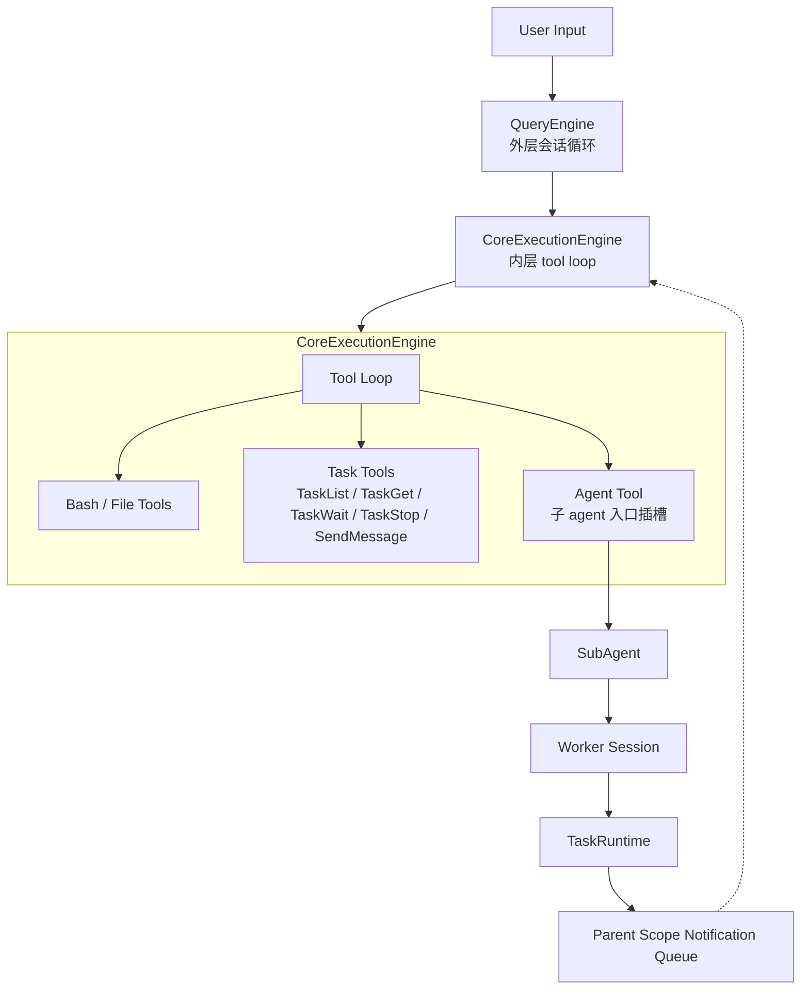
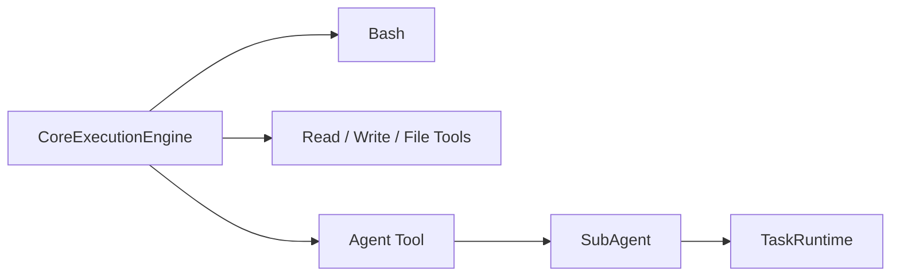
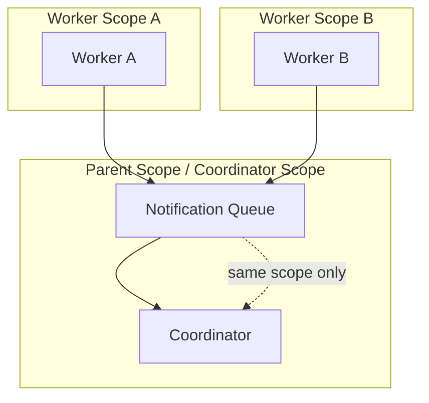
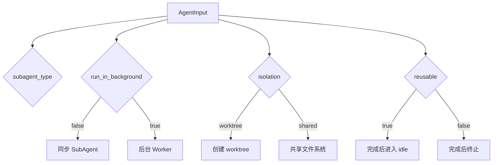

# XxCode 中的 Multi-Agent

> 本文解释 XxCode 的 multi-agent 是怎么工作的：它如何派生子 agent，如何控制权限、工具、记忆和隔离，以及 worker 的状态和通知如何在 scope 内流转。

## 目录

1. [它解决什么问题](#1-它解决什么问题)
2. [双层主循环与子 agent](#2-双层主循环与子-agent)
3. [Agent 类型与权限模型](#3-agent-类型与权限模型)
4. [Agent Tool 为什么是“插槽”](#4-agent-tool-为什么是插槽)
5. [运行时：worker scope 通知与任务工具](#5-运行时worker-scope-通知与任务工具)
6. [Agent Tool 执行协议](#6-agent-tool-执行协议)
7. [worktree 隔离与生命周期](#7-worktree-隔离与生命周期)
8. [记忆系统](#8-记忆系统)
9. [协作模式](#9-协作模式)
10. [设计原则](#10-设计原则)
11. [两个真实案例](#11-两个真实案例)
12. [失败案例：Coordinator 提前退出](#12-失败案例coordinator-提前退出)
13. [决策表](#13-决策表)
14. [术语表](#14-术语表)
15. [常见误解](#15-常见误解)
16. [实现映射](#16-实现映射)
17. [推荐继续阅读的源码入口](#17-推荐继续阅读的源码入口)

## 1. 它解决什么问题

XxCode 的 multi-agent 不是“同时开几个模型请求”，而是把协作流程工程化。

单个 agent 处理复杂任务时，常见问题是：

- 上下文越来越长
- 工具权限太散，容易越权或重复工作
- 多个任务同时推进时，文件状态容易互相干扰
- 任务状态和结果不容易收口

XxCode 的处理方式是把协作拆成几层：

- `QueryEngine` 管外层会话
- `CoreExecutionEngine` 管内层 tool loop
- `Agent Tool` 负责派生子 agent
- `TaskRuntime` 管 worker 生命周期和通知
- `worktree` 负责文件隔离

## 2. 双层主循环与子 agent



这张图抓住三件事：

- `QueryEngine` 在外层，只管会话和转接。
- `CoreExecutionEngine` 在内层，只管 tool loop。
- `Agent Tool` 是 tool loop 里的入口插槽，不是普通工具。

通知先回到 parent scope 的消息流，再由上层消费，不是直接回到 `CoreExecutionEngine` 的控制点。

`Agent Tool` 之所以单独画出来，是因为它通向的是另一层执行世界，而不是和 `Bash`、`Read`、`Write` 共享同一种路径。

## 3. Agent 类型与权限模型

内置 agent 类型有 5 种：

| 类型 | 作用 | `permission_mode` | 工具范围 | 隔离 |
| --- | --- | --- | --- | --- |
| `general-purpose` | 通用执行 | `inherit` | 全部工具 | 无 |
| `Explore` | 只读搜索 | `bypass` | `read_file` / `grep_search` / `glob_match` | 无 |
| `Plan` | 只读规划 | `bypass` | `read_file` / `grep_search` / `glob_match` | 无 |
| `Coordinator` | 编排 worker | `bypass` | `Agent` / `TaskList` / `TaskGet` / `TaskWait` / `TaskStop` / `SendMessage` | `worktree` |
| `docs-lookup` | 文档查询 | `inherit` | `read_file` / `grep_search` / `glob_match` | 无 |

这套类型系统的意义不是命名，而是边界：

- `Explore` 和 `Plan` 只读，适合前期探索。
- `Coordinator` 只负责组织其他 worker，不直接同步执行。
- `general-purpose` 是通用执行器，但权限会继承父级。
- `docs-lookup` 只做文档查询，不承担执行任务。

这里的类型名以 `definitions.py` 和 `AgentTool` 的 `subagent_type` 为准。也就是说，文档查询类型在当前代码里应该传 `docs-lookup`；如果某些系统提示或历史文档里出现 `claude-code-guide`，不要直接把它当成当前可用的 `subagent_type`，否则会走未知类型 fallback。

`Coordinator` 的工具边界尤其重要：它没有 `read_file`、`write_file`、`edit_file`、`Bash` 这类直接执行工具。它只能用 `Agent` 派 worker，再用 `TaskList` / `TaskWait` / `TaskGet` / `TaskStop` / `SendMessage` 管这些 worker，所以它的职责是编排，不是亲自读文件、改文件或跑命令。

`permission_mode` 的语义也很关键：

- `inherit`：子 agent 继承父级的权限状态。
- `bypass`：子 agent 直接进入 yolo 模式，绕过父级权限弹窗。

`max_turns` 是另一道安全阀。不同 agent 类型有不同上限，防止单个子 agent 无限转圈：

- `Explore = 30`
- `Plan = 40`
- `general-purpose = 50`
- `Coordinator = 100`
- `docs-lookup = 20`

达到上限时，`SubAgent` 不会继续空转；它会返回一个 `SubAgentRequestResult`，文本里说明已经达到最大 turn 数，并附上最后一段响应的前 500 个字符。

`Coordinator` 还有一个硬约束：它不能同步执行子 agent，必须用 `run_in_background=true` 派生 worker。这个限制不是建议，而是 `AgentTool` 里的直接拒绝。

## 4. Agent Tool 为什么是“插槽”

在 `CoreExecutionEngine` 的 tool loop 里，`Agent Tool` 的位置很特别。

它不是“再多一个普通工具”，而是主循环进入子 agent 世界的入口。



`Agent Tool` 的作用是把任务派生到另一个执行实例里。这个实例不是主 agent 本身，而是 `SubAgent`，后续会被 `TaskRuntime` 包装成 worker。

## 5. 运行时：worker scope 通知与任务工具

这一节把运行时的核心放在一起看，避免在状态机、通知和工具语义之间来回跳。

worker 的生命周期大致是：

`queued -> running -> idle/completed/failed/killed/interrupted`

其中：

- `reusable=True` 的 worker 完成后会进入 `idle`
- 可复用 worker 可以继续接 `SendMessage`
- 非可复用 worker 完成后直接进入终态

通知流转要按 `scope` 看，不是全局广播。



更准确地说：

- Worker 完成后，`TaskRuntime` 把通知写入对应的 `parent scope` 队列。
- Coordinator 在自己的 scope 里通过 `TaskWait` 或隐藏消息被动感知。
- 不是 worker 直接“发给 Coordinator”，而是 `TaskRuntime` 负责路由。

`reusable worker` 进入 `idle` 后，如果 15 分钟内没有新的消息，会因为 `IDLE_TTL_SECONDS = 900` 自动终止。终态 task 记录也会在 15 分钟后清理，避免 `TaskList` 长时间保留过期状态。

`reusable worker` 的核心价值不只是“能继续发消息”，而是它会保留同一个会话里的上下文。`SendMessage` 不是新建一个 worker，而是在同一个 worker 会话里追加新的请求，所以适合持续推进同一条任务线。

`TaskList`、`TaskGet`、`TaskWait`、`TaskStop`、`SendMessage` 这几个工具看起来像任务面板，但它们不是全局的。

它们都只作用于“当前 scope 的直接子任务”。这条约束非常关键：

- `TaskList` 只列出当前 scope 下的直接子任务
- `TaskGet` 只读取当前 scope 下的直接子任务
- `TaskWait` 只等待当前 scope 下的直接子任务
- `TaskStop` 只停止当前 scope 下的直接子任务
- `SendMessage` 只继续当前 scope 下的可复用 idle worker

换句话说，Coordinator 看到的不是全局 task 池，而是“自己这一层直接派出去的 worker”。

这也解释了为什么 `scope` 这么重要。它不是一个附加字段，而是任务可见性和通知路由的边界。

`TaskWait` 的语义也很明确：它等的是“稳定状态”，不是“最后一条状态变化”。所以一个 worker 进入 `idle` 或终态后，`TaskWait` 才会认为它稳定了。

`SendMessage` 只有在目标 worker 是 `idle` 且 `reusable=True` 时才会成功。它不是新建 worker，而是在同一个 worker 会话里追加一轮任务。

`TaskOutput` 不要和 `TaskWait` 混淆。当前 `src/xxcode/tools/tasks/tool.py` 里定义的是 `TaskList`、`TaskGet`、`TaskWait`、`TaskStop` 和 `SendMessage`；如果系统提示里仍出现标记为 deprecated 的 `TaskOutput`，可以把它理解成历史遗留的后台输出读取接口，而不是 multi-agent worker 的等待机制。等待子 agent worker 稳定下来，应该看 `TaskWait`。

## 6. Agent Tool 执行协议

`Agent Tool` 不是一个“再多一个工具”那么简单。它实际上定义了子 agent 的派生协议：传什么参数、走同步还是后台、是否复用 worker、要不要隔离文件系统，都会在这里分叉。

`AgentInput` 一共有 8 个字段：

- `description`：给 worker 的短描述
- `prompt`：真正交给子 agent 的任务指令
- `subagent_type`：决定使用哪一种 agent 定义
- `model`：可选模型覆盖
- `run_in_background`：是否立即返回 task_id
- `worker_label`：可读标签，便于区分同 scope 里的 worker
- `reusable`：完成后是否保留为 idle，等待 `SendMessage`
- `isolation`：是否启用 `worktree`

最关键的是三组组合：

- `subagent_type` 决定能力边界。它先选 `AgentDef`，再用 allowlist / denylist 过滤工具。
- `run_in_background` 决定执行形态。`false` 走同步子任务，`true` 走后台 worker。
- `reusable` 只对后台 worker 有意义。它决定 worker 结束后是 `idle` 还是直接终止。
- `isolation` 会影响同步和后台两条路径，但它最常被用在并行 worker 上，因为那时 worktree 的收益最大。



同步路径里，`AgentTool` 会先注册一个 foreground task，建立专用 `scope`，再创建 `SubAgent` 执行请求，最后清理 scope。
后台路径里，`AgentTool` 会先做同 scope 并发上限检查，再派生 worker 并立即返回 `task_id`。
如果当前调用者是 `Coordinator`，同步模式会直接被拒绝；这是 `AgentTool` 的硬编码约束，不是提示语气。

`isolation="worktree"` 时，`AgentTool` 会先尝试创建 worktree。失败时不会整条任务报废，而是降级到共享文件系统继续跑。

## 7. worktree 隔离与生命周期

`worktree` 是给并行 worker 准备的文件系统隔离层，不是默认强制项。

当 `isolation="worktree"` 或 agent 定义里指定了 worktree 时，`WorktreeManager` 会先用 `git rev-parse --show-toplevel` 找 repo root，再在 `.xxcode/worktrees/{agent_type}-{uuid}` 下创建独立工作区。

这里有几个压力路径值得单独写清楚：

- 创建 worktree 的命令有 30 秒超时
- 如果当前目录不是 git repo，会直接降级为共享文件系统
- `git worktree add` 失败时，会清理可能残留的空目录，然后继续降级
- 删除 worktree 时，先尝试 `git worktree remove --force`
- 如果 remove 失败或超时，会回退到强制目录删除

也就是说，worktree 的目标不是“必须成功”，而是“尽量隔离，失败时还能继续跑”。

这套清理还做了双保险：

- `WorkerSession` 结束时会清理自己的 worktree
- `cleanup_scope()` 在 scope 级别再做一次 belt-and-suspenders 清理

这样可以避免 worker 异常退出后，worktree 还静静留在磁盘上。

## 8. 记忆系统

主 agent 的记忆系统和子 agent 的记忆系统是分开的。

### 主 agent 记忆

主记忆路径解析是三层优先级：

1. `XXCODE_COWORK_MEMORY_PATH_OVERRIDE`
2. `auto_memory_directory`
3. 默认目录 `~/.XxCode/projects/{project_key}/memory/`

主记忆的入口也是 `MEMORY.md`。它先注入索引，再按需 recall 全量记忆。

主 agent 的 memory 注入发生在 query 进入主循环前后：系统会先刷新并注入 `MEMORY.md` 索引，让模型看到“有哪些记忆领域”；然后根据当前 query 做 recall，按需加载相关 memory 文件的完整内容。

### 子 agent 记忆

子 agent 按 agent 类型分 scope，路径大致是：

- `~/.XxCode/agent-memory/<type>/`
- `<repo>/.xxcode/agent-memory/<type>/`
- `<repo>/.xxcode/agent-memory-local/<type>/`

同样也是 `MEMORY.md` 作为入口索引。

子 agent memory 也是同样的两层模型：先把 agent 类型对应的 `MEMORY.md` 作为入口上下文注入，再根据当前子任务 recall 相关 full memories。区别在于它的语义更偏“某类 agent 的操作经验”，不是主 agent 的用户偏好或项目长期背景。

这篇只讲 multi-agent 中 memory 的接入位置。完整 memory 生命周期，包括 index、full memories、fresh recall、extraction 和 cleanup，可以看 `docs/memory-explained.md`。

### 对比

| 维度 | 主 agent 记忆 | 子 agent 记忆 |
| --- | --- | --- |
| 存储位置 | `~/.XxCode/projects/{project_key}/memory/` 等 | `~/.XxCode/agent-memory/<type>/` 等 |
| 入口 | `MEMORY.md` | `MEMORY.md` |
| 作用 | 会话和项目级持续记忆 | 类型化操作知识 |
| 触发 | 启动和 query 中刷新 / 召回 | 子 agent 启动和查询时注入 / 召回 |

## 9. 协作模式

当前实现支持的协作模式主要有：

- 串行执行
- 并行执行
- 可复用 worker
- Coordinator 编排多个 worker

如果只想记一版选型，可以直接记这四句：

- 读和定位优先 `Explore`
- 设计和拆解优先 `Plan`
- 要做完整任务就用 `general-purpose`
- 要统筹多个 worker 才上 `Coordinator`

并行有硬上限：

- `MAX_BACKGROUND_WORKERS_PER_SCOPE = 32`

这说明系统鼓励并行，但不鼓励失控并行。
这里没有投票或仲裁机制。Coordinator 可以比较多个 worker 的结果，但本质还是汇总和判断，不是投票。

## 10. 设计原则

这套系统的设计原则可以概括成一句话：

> 让协作变成可控的工程流程，而不是一堆松散的模型调用。

拆开看就是：

- 职责单一
- 最小上下文
- 明确权限边界
- 明确工具边界
- 可观察
- 可恢复

## 11. 两个真实案例

### 案例一：Coordinator + 2 个 Explore worker 并行搜索

用户说的是这类任务：

> 找出 auth 登录失败的根因，并告诉我最可能的两处代码位置。

这是典型的并行搜索场景，最合适的路径是：

1. 主 agent 先派一个 `Coordinator`。
2. `Coordinator` 再派两个 `Explore` worker。
3. 两个 worker 都是只读搜索，不需要文件修改权限，也不需要互相等待。
4. 一个 worker 查认证入口，另一个 worker 查错误处理链路。
5. `TaskRuntime` 把两个 worker 的完成通知写回 `Coordinator` 的 scope。
6. `Coordinator` 用 `TaskWait` 收齐结果，再用 `TaskGet` 把细节拉出来。
7. `Coordinator` 汇总后给出一个压缩后的判断。

对应的 tool-call 节奏大致是：

```text
Agent(subagent_type="Coordinator", run_in_background=true)
  -> task_id: "c1"

Coordinator scope:
  Agent(subagent_type="Explore", prompt="查认证入口", run_in_background=true)
    -> task_id: "w1"
  Agent(subagent_type="Explore", prompt="查错误处理链路", run_in_background=true)
    -> task_id: "w2"
  TaskWait(task_ids=["w1", "w2"], timeout_seconds=300)
  TaskGet(task_id="w1")
  TaskGet(task_id="w2")
  -> 汇总两个 worker 的发现
```

这个案例的重点不在“谁更聪明”，而在“把搜索拆开”。
因为 Explore worker 是只读的，所以几乎没有文件冲突；又因为结果都落在同一个 scope 里，所以 Coordinator 可以清楚地比较它们。
这里最不该做的事，是一边派 worker 一边轮询 `TaskList`。`TaskWait` 已经把“等通知”这件事做掉了，Coordinator 只需要等它返回，再读结果。

### 案例二：reusable worker 的二次追问

用户先让系统：

> 先快速梳理这个模块的入口和关键函数。

后面又接着追问：

> 再把这几个函数之间的调用链补全。

这类任务适合用 `reusable=true` 的 worker。

1. 主 agent 派一个后台 worker，标记为 reusable。
2. worker 做完第一轮搜索后进入 `idle`，而不是立刻销毁。
3. 主 agent 通过 `SendMessage` 再发第二轮 prompt。
4. worker 保留了上一轮上下文，继续补全同一块问题。
5. 如果后面还有第三轮，也可以继续复用。

对应的 tool-call 节奏大致是：

```text
Agent(subagent_type="Explore", run_in_background=true, reusable=true)
  -> task_id: "w1"

TaskWait(task_ids=["w1"], timeout_seconds=300)
TaskGet(task_id="w1")

SendMessage(task_id="w1", prompt="再把这几个函数之间的调用链补全")
TaskWait(task_ids=["w1"], timeout_seconds=300)
TaskGet(task_id="w1")
```

这比每一轮都新建 worker 更省上下文，也更适合“同一块问题连续推进”的场景。
前提也很严格：目标 worker 必须已经是 `idle`，而且必须真的是 reusable。否则 `SendMessage` 会直接失败。

## 12. 失败案例：Coordinator 提前退出

这是最值得写进文档的失败路径之一，因为它说明 runtime 不是只会“跑成功”，还会“善后”。

一个常见场景是：

1. 主 agent 派出 `Coordinator`。
2. `Coordinator` 已经发出两个后台 worker。
3. 其中一个 worker 还在运行，另一个已经接近结束。
4. `Coordinator` 自己先报错、提前退出，或者被上层停止。
5. `TaskRuntime` 触发 scope 清理。

清理时不会只管 Coordinator 自己。`cleanup_scope()` 会递归走它的子任务，把未完成的 worker 先停掉，再把对应 worktree 一起清掉。
返回的 `ScopeCleanupReport` 也会把这次清理到底停了多少个活着的 worker、删了多少个记录说清楚，方便上层知道这次收尾有多重。

这就是那层 belt-and-suspenders 逻辑的意义：

- 终止活着的子 worker
- 清掉残留的 worktree
- 避免 scope 留下“看起来完成了、其实没收干净”的半残状态

所以在这个系统里，提前退出不是纯失败，它是一种可收敛的失败。

## 13. 决策表

| 场景 | 推荐组合 | 不建议 | 理由 |
| --- | --- | --- | --- |
| 只查少量代码位置 | `Explore`，可直接用 | 上 Coordinator | 任务太小，编排成本高于收益。 |
| 需要多步改动或验证 | `general-purpose` 或 `Coordinator + workers` | 只用单个短 turn agent | 长流程更需要分工和收尾。 |
| 要并行搜索两个互不相关位置 | `Coordinator + 2x Explore` | 串行查完再说 | 并行最能节省等待时间。 |
| 同一问题要连续追问 | `reusable=true` + `SendMessage` | 每轮都新建 worker | 复用能保住上下文。 |
| 需要文件互不干扰的修改 | `isolation="worktree"` | 在共享 FS 里硬并行写 | worktree 更适合并发写操作。 |
| 要求长流程但单线推进 | 非并行 worker | 逼着 Coordinator 再拆层 | 不必要的编排只会增加噪音。 |
| 想用 Coordinator 同步直接执行 | 不行 | `run_in_background=false` | 这是硬约束，系统会拒绝。 |
| 已经接近 32 个后台 worker | 停一下，先收敛 | 继续堆 worker | `MAX_BACKGROUND_WORKERS_PER_SCOPE` 不是上限挑战赛。 |

## 14. 术语表

| 术语 | 含义 |
| --- | --- |
| `AgentDef` | agent 类型的静态定义，决定权限、工具、隔离和 turn 上限。 |
| `SubAgent` | 主 agent 通过 `Agent Tool` 派生出来的执行实例。 |
| `Worker` | `SubAgent` 的后台运行形态，有独立生命周期。 |
| `Coordinator` | 专门编排其他 worker 的 agent 类型。 |
| `scope` | 任务和通知的隔离边界。 |
| `reusable worker` | 完成后保持 `idle`，后续可用 `SendMessage` 继续，15 分钟无新消息会自动终止。 |
| `worktree` | git 独立工作区，用来隔离文件修改。 |
| `<task-notification>` | worker 状态变化回传父层的消息格式。 |
| `TaskRuntime` | 管理 worker、scope、通知、清理的运行时。 |
| `Agent Tool` | 主循环进入子 agent 世界的入口插槽。 |

## 15. 常见误解

### 1. Agent 和 Worker 是不是一回事

不是。

- `Agent` 是上位概念。
- `AgentDef` 是静态定义。
- `SubAgent` 是被派生出来的执行实例。
- `Worker` 是这个实例在后台运行时的形态。

### 2. Coordinator 是不是负责亲自执行任务

不是主要职责。

`Coordinator` 的工作是编排 worker，不是同步执行任务。它靠 `Agent`、`TaskList`、`TaskWait`、`TaskGet`、`TaskStop`、`SendMessage` 来组织协作；它没有直接读写文件或运行命令的工具。

### 3. worktree 会不会自动继承到所有 worker

不会自动继承。

`Coordinator` 自己的定义里有 `isolation="worktree"`，`Agent Tool` 也会引导模型为 worker 启用 worktree，但 worker 是否真正隔离，还是取决于它自己的定义和显式参数。

### 4. 通知是不是 worker 直接发给 Coordinator

不是。

更准确地说，是 `TaskRuntime` 把通知写入对应的 parent scope 队列，Coordinator 在自己的 scope 里感知这些变化。

## 16. 实现映射

| 模块 | 作用 |
| --- | --- |
| `src/xxcode/agent/query_engine.py` | 外层会话循环，管 turn 和会话状态。 |
| `src/xxcode/agent/loop.py` | 内层 tool loop，负责工具调用和执行推进。 |
| `src/xxcode/tools/agent/tool.py` | `Agent Tool`，子 agent 的唯一入口。 |
| `src/xxcode/agent/task_runtime.py` | worker 生命周期、scope、通知、清理。 |
| `src/xxcode/agent/definitions.py` | agent 类型定义、权限模式、工具过滤。 |
| `src/xxcode/agent/worktree.py` | git worktree 隔离。 |
| `src/xxcode/memory/resolution.py` | 主记忆目录解析。 |
| `src/xxcode/memory/injection.py` | 主记忆注入与 recall 消息。 |
| `src/xxcode/memory/agent_memory.py` | 子 agent 记忆作用域与注入。 |
| `src/xxcode/tools/tasks/tool.py` | `TaskList` / `TaskGet` / `TaskWait` / `TaskStop` / `SendMessage`。 |

## 17. 推荐继续阅读的源码入口

如果想顺着源码把这篇文档串起来，建议从这几个点读：

- `src/xxcode/tools/agent/tool.py`：`AgentInput`、同步/后台分叉、`reusable`、`isolation`、并发上限。
- `src/xxcode/agent/definitions.py`：`Explore`、`Plan`、`Coordinator` 等 agent 类型定义，以及 `max_turns` 和工具过滤。
- `src/xxcode/agent/task_runtime.py`：worker 状态机、scope、通知队列、`TaskWait` 的 Future 注册、清理逻辑。
- `src/xxcode/tools/tasks/tool.py`：`TaskList`、`TaskGet`、`TaskWait`、`TaskStop`、`SendMessage` 的语义边界。
- `src/xxcode/agent/worktree.py`：worktree 创建、删除、超时降级和兜底清理。
- `src/xxcode/agent/subagent.py`：子 agent 会话如何真正跑起来，以及为什么 turn 上限会生效。

阅读顺序建议先看 `tool.py` 和 `definitions.py`，再看 `task_runtime.py`，然后补 `tools/tasks/tool.py` 和 `worktree.py`，最后回到 `subagent.py` 看执行细节。这样最容易把“怎么派生、怎么协作、怎么收尾”连成一条线。

## 总结

XxCode 的 multi-agent 不是松散的多智能体集合，而是一套有明确边界的运行时。
它把这些东西都收进了同一套框架里：

- 双层主循环
- Agent 类型体系
- 权限模型
- 工具过滤
- worker 生命周期
- scope 通知
- worktree 隔离
- 可复用 worker

所以它真正解决的不是“能不能多开几个 agent”，而是：
**如何让多个 agent 在同一个工程里协作，但又不把上下文、权限和文件系统弄乱。**
